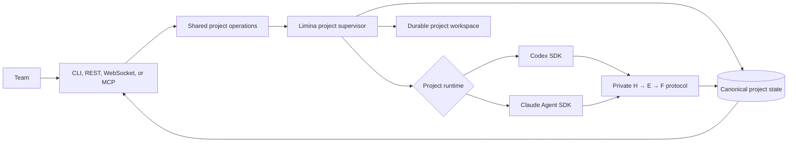

```
  ██╗     ██╗███╗   ███╗██╗███╗   ██╗ █████╗
  ██║     ██║████╗ ████║██║████╗  ██║██╔══██╗
  ██║     ██║██╔████╔██║██║██╔██╗ ██║███████║
  ██║     ██║██║╚██╔╝██║██║██║╚██╗██║██╔══██║
  ███████╗██║██║ ╚═╝ ██║██║██║ ╚████║██║  ██║
  ╚══════╝╚═╝╚═╝     ╚═╝╚═╝╚═╝  ╚═══╝╚═╝  ╚═╝

  from Latin līmen — "threshold"
  Cross the boundary between known and unknown.
```

[](https://opensource.org/licenses/Apache-2.0)
[](https://github.com/theam/limina/stargazers)
[](https://github.com/theam/limina/network/members)

Give Limina a problem with a measurable goal. It will autonomously research it — forming
hypotheses, running experiments, challenging its own direction — until it finds a solution backed
by evidence, or tells you what it learned trying.

Limina is useful anywhere progress can be evaluated: improving retrieval quality, investigating a
production regression, comparing technical approaches, testing product changes, or researching a
new capability. It keeps the complete evidence trail, so the result is not just an answer — it is a
reviewable account of what was tried, what worked, what failed, and why.

## Choose how to use Limina

Limina provides two ways to run the same evidence-first research loop:

| | Managed runtime | Project template |
|---|---|---|
| Recommendation | **Recommended for most users** | Choose for the lightest local setup |
| Execution | Limina owns long-running Codex or Claude Code execution, recovery, and retries | You run Codex or Claude Code directly in the generated project |
| Collaboration | Shared projects through CLI, REST, WebSocket, and MCP | Markdown and Git collaboration |
| Durable state | Canonical database plus portable Markdown export | `kb/` Markdown files are canonical |
| Operations | One server manages projects, credentials, resources, steering, and observability | No server; your agent session reads and writes the project repository |
| Choose it when | A team needs asynchronous work, shared steering, or execution that survives terminals | One person wants a portable research harness with almost no infrastructure |

Start with the **managed runtime** unless you specifically want to operate the agent sessions
yourself. Both paths enforce the same Hypothesis → Experiment → Finding evidence chain and produce
a durable knowledge base.

## Managed runtime quick start — recommended

You need Docker to run the server and [`uv`](https://docs.astral.sh/uv/) if you want the host CLI.
The local stack binds only to `127.0.0.1` and needs no extra configuration. Start the server with
one command:

```bash
git clone https://github.com/theam/limina.git
cd limina
docker compose up --build
```

Install the CLI in another terminal (`uv tool install .`) and authenticate the engines you use.
Codex supports either your ChatGPT account or a server API key:

```bash
# Interactive device login; the credential remains in the limina-data volume.
limina runtime codex login

# Or put OPENAI_API_KEY in .env, restart, then materialize it explicitly.
limina runtime codex login --method api-key

# Claude Code uses its server credential from .env.
# ANTHROPIC_API_KEY=...
```

By default, Limina reuses an existing ChatGPT login or falls back to your configured API key, and
it keeps raw provider credentials out of project environments. See the
[managed runtime guide](#managed-runtime-guide) for authentication and credential-storage details.

The no-token default is deliberately limited to the localhost-only Compose stack. If you set a
local token, use two different values: `LIMINA_API_TOKEN` operates projects and
`LIMINA_ADMIN_API_TOKEN` changes instance runtime configuration. Team and internet deployments
should use OIDC; see [Security boundary](#security-boundary).

The one container applies migrations and starts the API and supervisor. The `limina-data` Docker
volume preserves the database, project workspaces, private engine continuation data, and the local
secret-encryption key.

In another terminal:

```bash
export LIMINA_ACTOR=adrian

limina doctor
```

`LIMINA_URL` defaults to `http://127.0.0.1:7433`. `doctor` confirms connectivity and reports the
available engines.

From there, you give Limina the mission, success criteria, context, and resources. Limina owns the
provider sessions and continues working when no user is attached. The sections below document the
full managed-runtime workflow.

## Project template quick start

The template path keeps Limina inside a normal repository. There is no server or database: your
agent uses `AGENTS.md` or `CLAUDE.md`, the repository hooks, and the file-backed `kb/` directly.

Open [Claude Code](https://docs.anthropic.com/en/docs/claude-code) or
[Codex](https://openai.com/index/introducing-codex/) and paste:

```text
Install the Limina research skill by running:
curl -fsSL https://raw.githubusercontent.com/theam/limina/main/setup.sh | bash
Then help me create a new Limina research project in the folder I choose.
```

The skill guides you through the project name, objective, context, measurable success criteria,
resources, autonomy boundaries, and escalation rules. It creates an independent repository with
the Limina template and validates its initial knowledge base.

When setup is complete, open that project in Claude Code or Codex and start the autonomous run:

```text
/goal Continue Limina research until the mission success criteria are satisfied
```

In this path, closing the agent session stops active execution. The next session reconstructs the
mission from `kb/mission/CHALLENGE.md`, `kb/ACTIVE.md`, and the linked evidence. Choose the managed
runtime instead when execution should continue independently of a user's terminal.

## The shared research loop

Whichever path you choose, the user-facing workflow is the same:

1. **Define a mission.** State the problem, measurable goal, baseline, resources, boundaries, and
   when Limina should ask for help.
2. **Let it investigate.** Limina searches existing approaches, forms falsifiable hypotheses, runs
   controlled experiments, records findings, and challenges its current direction.
3. **Review and steer.** You review the work and knowledge, provide missing resources, and change
   the strategy when the evidence calls for it.
4. **Get an evidence-backed result.** Limina either reaches the success criteria or explains what
   it established, what failed, and what uncertainty remains.

The durable research core is:

```text
Mission → Hypothesis → Experiment → Finding → Decision
```

`CHALLENGE.md` defines the mission. `ACTIVE.md` holds only the current objective, next step, and
blocker. Small linked artifacts preserve literature, hypotheses, experiments, findings, challenge
reviews, and strategic reviews without requiring the entire history in every model context.

## Managed runtime guide

The remainder of this README describes the recommended managed runtime. The
[template files](templates/), [validator](scripts/kb_validate.py), and
[project-creation skill](skill/SKILL.md) are the implementation of the lighter template path.

## Use the API or MCP

The same server also exposes a versioned REST API and a Streamable HTTP MCP server. These are not
separate runtimes: CLI, REST, WebSocket, and MCP all call the same project operations and observe
the same database, event sequence, managed execution loop, and knowledge graph.

Use REST for services and automation. The typed OpenAPI document is available at `/openapi.json`,
with an interactive explorer at `/docs`. Every project request uses a bearer token. In local mode,
`X-Limina-Actor` supplies attribution; in OIDC mode Limina derives identity from signed claims and
ignores that header. Mutations carry an idempotency key for safe retries:

```bash
curl -X POST http://127.0.0.1:7433/v1/projects \
  -H "Authorization: Bearer $LIMINA_API_TOKEN" \
  -H "X-Limina-Actor: $LIMINA_ACTOR" \
  -H "Idempotency-Key: $(uuidgen)" \
  -H "Content-Type: application/json" \
  -d '{
    "slug": "retrieval-codex",
    "name": "Multilingual retrieval",
    "objective": "Improve multilingual product retrieval",
    "success_criteria": "Increase held-out NDCG by 10% without a P95 latency regression",
    "context": "The current baseline combines BM25 with embeddings",
    "runtime": "codex"
  }'

curl http://127.0.0.1:7433/v1/projects/retrieval-codex/review \
  -H "Authorization: Bearer $LIMINA_API_TOKEN"
```

Use MCP when another agent should review or operate Limina at the same human-facing boundary. For
Codex, add this to `~/.codex/config.toml` (or the trusted project's `.codex/config.toml`):

```toml
[mcp_servers.limina]
url = "http://127.0.0.1:7433/mcp/"
bearer_token_env_var = "LIMINA_API_TOKEN"

[mcp_servers.limina.env_http_headers]
"X-Limina-Actor" = "LIMINA_ACTOR"
```

For Claude Code, register the same endpoint without storing the token in the file:

```bash
claude mcp add-json --scope user limina \
  '{"type":"http","url":"http://127.0.0.1:7433/mcp/","headers":{"Authorization":"Bearer ${LIMINA_API_TOKEN}","X-Limina-Actor":"${LIMINA_ACTOR}"}}'
```

The MCP surface provides tools to create and manage projects, preflight kickoff, steer strategy,
query the knowledge graph, inspect runs and analytics, read ordered activity, and manage visible
variables and sources. It also provides read-only
`limina://projects/...` resources for status, reviews, individual H/E/F artifacts, and Markdown
snapshots. It deliberately does not accept secret values in model-visible tool arguments; set or
rotate secrets with `limina resource secret` or the authenticated REST endpoint.

For a remote hostname, add it to the server's DNS-rebinding allowlist before starting Compose:

```bash
LIMINA_MCP_ALLOWED_HOSTS=limina.example.com docker compose up --build
```

If a browser-based MCP client sends an `Origin` header, also set
`LIMINA_MCP_ALLOWED_ORIGINS=https://your-client.example.com`. TLS remains required outside a
trusted local network.

### UI-ready project surfaces

REST and MCP share one authorization and operation layer. The backend exposes the primitives a UI
needs without requiring it to understand provider sessions:

- editable project kickoff drafts, built-in templates, preflight checks, memberships, and roles;
- durable guidance bodies with actor, delivery, pending/acknowledged state, and timestamps;
- paginated project, review, event, run, and knowledge queries;
- PostgreSQL full-text search with a portable SQLite fallback;
- H → E → F nodes, revisions, explicit relations/backlinks, comments, tags, and saved views;
- registered URLs, connectors, and bounded project-workspace uploads;
- structured runtime runs with per-turn input, cached, output, reasoning, and total tokens, plus
  explicit provider or operator-rate cost provenance;
- aggregate and daily time-series analytics for runs, knowledge throughput, and human-response
  latency;
- one-time live tickets carried in the `limina.ticket.<ticket>` WebSocket subprotocol, never URLs.

Semantic/vector retrieval is deliberately a later search backend. Full-text search and explicit
relations provide deterministic relevance and graph semantics first, without inventing embedding
infrastructure before there is evidence it improves project review.

## Create a project

Choose the engine once, when the project is created:

```bash
# Codex is the default
limina project create retrieval-codex \
  --runtime codex \
  --name "Multilingual retrieval — Codex" \
  --mission "Improve multilingual product retrieval" \
  --success "Increase held-out NDCG by 10% without a P95 latency regression" \
  --context "The current baseline combines BM25 with embeddings"

# Or run the same kind of mission with Claude Code
limina project create retrieval-claude \
  --runtime claude-code \
  --name "Multilingual retrieval — Claude" \
  --mission "Improve multilingual product retrieval" \
  --success "Increase held-out NDCG by 10% without a P95 latency regression" \
  --context "The current baseline combines BM25 with embeddings"
```

The runtime and kickoff brief may be edited while the project is still `CREATED`. They become
immutable at the first start, which keeps the workspace, continuation history, audit trail, and
behavior coherent. Create another project when you want an independent run or an engine
comparison. Creating records the brief; execution starts only when you say so.

## Provide resources

Resources belong to a project, not to a provider. The selected runtime receives them only during
that project's managed turns.

Variables are visible configuration and references:

```bash
limina resource variable retrieval-claude SOURCE_REPO_URL https://github.com/acme/search
limina resource variable retrieval-claude EVAL_SET_URI s3://research/eval-v3.parquet
```

Secrets are encrypted and write-only. Read them from an environment variable, standard input, or
a hidden prompt—never put the value directly in shell history:

```bash
limina resource secret retrieval-claude GITHUB_TOKEN --from-env GITHUB_TOKEN
printf '%s' "$AWS_SESSION_TOKEN" | \
  limina resource secret retrieval-claude AWS_SESSION_TOKEN --from-stdin
limina resource secret retrieval-claude SERVICE_API_KEY

limina resource list retrieval-claude
```

Secret values are not returned by the public API. Limina redacts exact values from runtime events,
decisions, and adapter failures, and prevents project resources from overriding control-plane or
provider credential names. Setting, rotating, or revoking a resource during active work causes a
controlled turn restart, so the child process receives a fresh environment and revoked values do
not linger in the old process.

## Start it and leave

```bash
limina start retrieval-claude
limina status retrieval-claude
```

Limina now owns the execution loop. Closing the terminal does not stop the project. A server
restart reconstructs active project loops and resumes each provider's private continuation.

## Collaborate

Every teammate connects to the same instance. A local shared-token instance accepts an attribution
name; an OIDC instance derives the teammate identity and project role from authenticated state:

```bash
export LIMINA_URL=https://limina.example.com
export LIMINA_API_TOKEN=...
export LIMINA_ACTOR=maya
```

Follow durable activity:

```bash
limina watch retrieval-claude
```

`Ctrl-C` stops watching, not the project. Events can be replayed after a disconnect.

Steer asynchronously:

```bash
limina steer retrieval-claude \
  "Compare against the strongest cross-encoder baseline before drawing a conclusion."

limina steer retrieval-claude \
  'Approved to spend up to $100 on the larger evaluation.' \
  --kind APPROVAL
```

Guidance is committed before delivery. With Codex, Limina steers the active turn directly. With
Claude Code, Limina interrupts the active response and immediately continues the same managed
session with the new direction. If no turn is active, either engine receives the queued guidance
on its next turn.

Enter the live project when synchronous steering matters:

```bash
limina attach retrieval-claude
```

```text
limina> Prioritize generalization over a benchmark-specific improvement.
limina> /pause
limina> /resume
limina> /interrupt
limina> /detach
```

Plain text steers the managed runtime. `/detach` only leaves the live view. Multiple teammates may
attach at once; everyone sees the same attributed, durable event sequence.

## Review knowledge

```bash
limina review retrieval-claude
limina review retrieval-claude --artifact H001
limina review retrieval-claude --artifact E003
limina review retrieval-claude --artifact F002
```

Limina enforces the evidence chain:

```text
Hypothesis → Experiment → Finding
```

Experiments require hypotheses, and findings require completed experiments. Observations are
append-only; IDs are allocated atomically; independent experiments can write concurrently; and
stale decisions are rejected instead of overwriting newer knowledge.

Export a deterministic Markdown projection for offline review, Obsidian, archival, or Git:

```bash
limina export retrieval-claude ./retrieval-kb
```

The database is canonical while a project runs. Markdown and Git are review and portability
surfaces, not the live coordination mechanism.

## Lifecycle and commands

```bash
limina project list
limina project show retrieval-claude

limina pause retrieval-claude
limina resume retrieval-claude
limina stop retrieval-claude
limina project archive retrieval-claude
```

- `pause` interrupts active work and preserves resumability.
- `resume` continues a paused, waiting, stopped, or failed project.
- `stop` ends execution without deleting history or knowledge.
- `archive` hides an inactive project from the default list without deleting it.

| Command | Purpose |
|---|---|
| `limina project create/list/show/archive` | Manage durable projects and select their runtime |
| `limina start/pause/resume/stop` | Control project lifecycle |
| `limina status` | See objective, next step, blocker, and progress |
| `limina resource variable/secret/list/remove` | Manage project-scoped access |
| `limina watch` | Follow durable activity |
| `limina steer` | Send durable feedback, answers, approvals, or blockers |
| `limina attach` | Watch and steer an active project interactively |
| `limina review` | Review hypotheses, experiments, findings, and evidence |
| `limina export` | Produce a portable Markdown knowledge base |
| `limina doctor` | Verify the instance and available runtime engines |
| `limina runtime codex status/login/logout` | Administer the node-owned Codex login |

Run `limina --help` or `limina <command> --help` for the full interface. Non-interactive commands
support global JSON output:

```bash
limina --json project show retrieval-claude | jq '.runtime'
limina --json review retrieval-claude | jq '.findings[] | {id, title}'
```

## Runtime ownership



Each active project has one Limina-owned supervisory loop and exactly one engine. The loop creates
or resumes the private continuation, injects project resources, streams selected activity,
checkpoints progress, and recovers after process restarts. Users never operate workers, sessions,
threads, subagents, leases, versions, or checkpoints.

## Deployment

The default single-instance topology uses SQLite, one persistent volume, localhost-only exposure,
and unauthenticated `/livez` and `/readyz` probes:

```bash
docker compose up --build
```

Use PostgreSQL when you need managed database operations or plan for multiple runtime replicas:

```bash
docker compose -f compose.cloud.yaml up --build
```

The same runtime image contains both engine adapters. PostgreSQL coordinates project ownership,
atomic artifact IDs, scoped experiment writes, compare-and-swap decisions, idempotent mutations,
and ordered human guidance.

## Security boundary

Local token mode has separate project and instance-administrator credentials. It also applies
per-client authentication throttling plus a higher transport-wide emergency ceiling (configure
the latter with `LIMINA_GLOBAL_AUTH_FAILURE_LIMIT`; it defaults to 1000 failures per window), so a
single bad client cannot consume the shared ten-attempt client budget. The transport-wide ceiling
also bounds failed authentication through WebSocket and MCP. Team deployments use
provider-neutral OIDC discovery,
JWKS signature verification, issuer/audience/expiry validation, server-derived identity, and
project `OWNER`, `EDITOR`, and `VIEWER` roles. Configure it in `.env`:

```dotenv
LIMINA_OIDC_ISSUER=https://identity.example.com
LIMINA_OIDC_AUDIENCE=limina-api
# Optional when discovery does not advertise the desired endpoint:
# LIMINA_OIDC_JWKS_URL=https://identity.example.com/.well-known/jwks.json
# Optional instance administrator mapping:
# LIMINA_OIDC_ADMIN_CLAIM=roles
# LIMINA_OIDC_ADMIN_VALUE=limina-admin
# Optional 0-300 second clock-skew tolerance (default 30):
# LIMINA_OIDC_LEEWAY_SECONDS=30
LIMINA_CORS_ORIGINS=https://limina-ui.example.com
```

Then run the same command: `docker compose up --build`. Do not set `LIMINA_API_TOKEN` in OIDC
mode. Limina refuses a non-local bind unless one of these authentication modes is configured.

Terminate the API behind TLS. For an untrusted multi-tenant service, also load
`LIMINA_SECRET_KEY` from a secrets manager, isolate project workspaces with containers or
microVMs, and add quotas, external object storage, and audit export. Native run telemetry and
analytics diagnose Limina work; infrastructure logs/traces should still be exported by the
deployment platform.

Registered `URL` sources must use HTTP or HTTPS. URL and connector URIs cannot embed credentials
in user-info or credential-like query parameters; keep those values in write-only encrypted
project secrets.

The managed model process does not receive the database URL or Limina administrative token. It
gets a short-lived capability scoped to the active project. See the
[architecture decision](docs/cloud-runtime-architecture.md) for the full trust and concurrency
model.

ChatGPT login is intentionally a single-runtime-node feature because Codex refreshes the shared
credential store. Limina serializes ChatGPT-backed Codex turns and blocks login/logout while a
turn is active. Use API-key mode for horizontally parallel Codex workloads. The Codex process must
read its credential store to operate; environment scrubbing does not claim to hide that file from
Codex itself.

`LIMINA_CODEX_AUTH_MODE=auto` (the default) preserves an existing ChatGPT login and otherwise uses
`CODEX_ACCESS_TOKEN` or `OPENAI_API_KEY` when configured. Set it to `chatgpt`, `api-key`, or
`access-token` to enforce one method. Limina creates `CODEX_HOME` on a fresh volume, persists the
official Codex credential store there with private permissions, and removes raw provider
credentials from project child environments.

Transient provider failures create separate durable run attempts with retry ordinals and a
persisted `wake_at`; default backoff is 30, 120, and 600 seconds. Override it with
`LIMINA_RUNTIME_RETRY_DELAYS_SECONDS`. Optional cost estimates require all three operator rates:
`LIMINA_CODEX_INPUT_USD_PER_MILLION_TOKENS`,
`LIMINA_CODEX_CACHED_INPUT_USD_PER_MILLION_TOKENS`, and
`LIMINA_CODEX_OUTPUT_USD_PER_MILLION_TOKENS`.

## Development

Install both managed runtimes and run the acceptance suite:

```bash
uv sync --locked --all-extras --dev
make runtime-check
```

Run locally with either or both provider credentials:

```bash
export LIMINA_API_TOKEN=local-secret
export OPENAI_API_KEY=...       # optional: Codex projects
export ANTHROPIC_API_KEY=...    # optional: Claude Code projects
uv run limina serve
```

Further reading:

- [CLI user story](docs/cloud-runtime-cli.md)
- [Architecture and concurrency model](docs/cloud-runtime-architecture.md)
- [UI-ready backend and API map](docs/ui-ready-backend.md)
- [Verification evidence](docs/cloud-runtime-evidence.md)

## Contributing

- [Open an issue](https://github.com/theam/limina/issues) for bugs and feature requests.
- [Start a discussion](https://github.com/theam/limina/discussions) for design questions.

Built by [The Agile Monkeys](https://theagilemonkeys.com).

## License

Apache 2.0, © The Agile Monkeys. See [LICENSE](./LICENSE).
