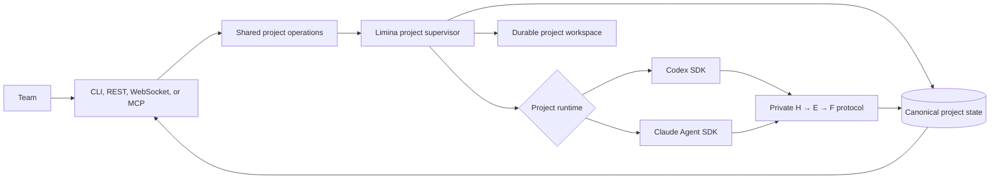

```
  ██╗     ██╗███╗   ███╗██╗███╗   ██╗ █████╗
  ██║     ██║████╗ ████║██║████╗  ██║██╔══██╗
  ██║     ██║██╔████╔██║██║██╔██╗ ██║███████║
  ██║     ██║██║╚██╔╝██║██║██║╚██╗██║██╔══██║
  ███████╗██║██║ ╚═╝ ██║██║██║ ╚████║██║  ██║
  ╚══════╝╚═╝╚═╝     ╚═╝╚═╝╚═╝  ╚═══╝╚═╝  ╚═╝

  from Latin līmen — "threshold"
  Cross the boundary between known and unknown.
```

[](https://opensource.org/licenses/Apache-2.0)
[](https://github.com/theam/limina/stargazers)

Limina is a collaborative managed runtime for long-running, evidence-driven work. Humans use its
CLI, services use its REST API, and collaborating agents use its MCP server. Each project runs on
a Limina-managed **Codex** or **Claude Code** engine.

Your team operates projects: provide missions and resources, review accepted knowledge, and steer
strategy. Limina operates everything below that boundary: model sessions, turns, subagents,
workspaces, retries, leases, checkpoints, and restart recovery.

## Quick start

You need Docker to run the server and [`uv`](https://docs.astral.sh/uv/) if you want the host CLI.
Add the credential for each engine you intend to use:

```bash
git clone https://github.com/theam/limina.git
cd limina
uv tool install .  # optional for API/MCP-only use

cat > .env <<'ENV'
LIMINA_API_TOKEN=replace-with-a-long-random-value
OPENAI_API_KEY=...       # Codex projects
ANTHROPIC_API_KEY=...    # Claude Code projects
ENV

docker compose up --build
```

Only `LIMINA_API_TOKEN` is required to start the server. A project needs working credentials for
its selected engine when execution starts. You may configure either provider or both.

The one container applies migrations and starts the API and supervisor. The `limina-data` Docker
volume preserves the database, project workspaces, private engine continuation data, and the local
secret-encryption key.

In another terminal:

```bash
export LIMINA_API_TOKEN=replace-with-the-same-value
export LIMINA_ACTOR=adrian

limina doctor
```

`LIMINA_URL` defaults to `http://127.0.0.1:7433`. `doctor` confirms connectivity and reports the
available engines.

## Use the API or MCP

The same server also exposes a versioned REST API and a Streamable HTTP MCP server. These are not
separate runtimes: CLI, REST, WebSocket, and MCP all call the same project operations and observe
the same database, event sequence, managed execution loop, and knowledge graph.

Use REST for services and automation. The OpenAPI document is available at `/openapi.json`, with
an interactive explorer at `/docs`. Every project request uses the instance bearer token.
Mutations also carry an actor for team attribution and an idempotency key for safe retries:

```bash
curl -X POST http://127.0.0.1:7433/v1/projects \
  -H "Authorization: Bearer $LIMINA_API_TOKEN" \
  -H "X-Limina-Actor: $LIMINA_ACTOR" \
  -H "Idempotency-Key: $(uuidgen)" \
  -H "Content-Type: application/json" \
  -d '{
    "slug": "retrieval-codex",
    "name": "Multilingual retrieval",
    "objective": "Improve multilingual product retrieval",
    "success_criteria": "Increase held-out NDCG by 10% without a P95 latency regression",
    "context": "The current baseline combines BM25 with embeddings",
    "runtime": "codex"
  }'

curl http://127.0.0.1:7433/v1/projects/retrieval-codex/review \
  -H "Authorization: Bearer $LIMINA_API_TOKEN"
```

Use MCP when another agent should review or operate Limina at the same human-facing boundary. For
Codex, add this to `~/.codex/config.toml` (or the trusted project's `.codex/config.toml`):

```toml
[mcp_servers.limina]
url = "http://127.0.0.1:7433/mcp/"
bearer_token_env_var = "LIMINA_API_TOKEN"

[mcp_servers.limina.env_http_headers]
"X-Limina-Actor" = "LIMINA_ACTOR"
```

For Claude Code, register the same endpoint without storing the token in the file:

```bash
claude mcp add-json --scope user limina \
  '{"type":"http","url":"http://127.0.0.1:7433/mcp/","headers":{"Authorization":"Bearer ${LIMINA_API_TOKEN}","X-Limina-Actor":"${LIMINA_ACTOR}"}}'
```

The MCP surface provides tools to create and manage projects, steer strategy, review knowledge,
read ordered activity, and manage visible variables. It also provides read-only
`limina://projects/...` resources for status, reviews, individual H/E/F artifacts, and Markdown
snapshots. It deliberately does not accept secret values in model-visible tool arguments; set or
rotate secrets with `limina resource secret` or the authenticated REST endpoint.

For a remote hostname, add it to the server's DNS-rebinding allowlist before starting Compose:

```bash
LIMINA_MCP_ALLOWED_HOSTS=limina.example.com docker compose up --build
```

If a browser-based MCP client sends an `Origin` header, also set
`LIMINA_MCP_ALLOWED_ORIGINS=https://your-client.example.com`. TLS remains required outside a
trusted local network.

## Create a project

Choose the engine once, when the project is created:

```bash
# Codex is the default
limina project create retrieval-codex \
  --runtime codex \
  --name "Multilingual retrieval — Codex" \
  --mission "Improve multilingual product retrieval" \
  --success "Increase held-out NDCG by 10% without a P95 latency regression" \
  --context "The current baseline combines BM25 with embeddings"

# Or run the same kind of mission with Claude Code
limina project create retrieval-claude \
  --runtime claude-code \
  --name "Multilingual retrieval — Claude" \
  --mission "Improve multilingual product retrieval" \
  --success "Increase held-out NDCG by 10% without a P95 latency regression" \
  --context "The current baseline combines BM25 with embeddings"
```

The runtime is immutable for a project. This keeps its workspace, continuation history, audit
trail, and behavior coherent. Create another project when you want an independent run or an
engine comparison. Creating records the brief; execution starts only when you say so.

## Provide resources

Resources belong to a project, not to a provider. The selected runtime receives them only during
that project's managed turns.

Variables are visible configuration and references:

```bash
limina resource variable retrieval-claude SOURCE_REPO_URL https://github.com/acme/search
limina resource variable retrieval-claude EVAL_SET_URI s3://research/eval-v3.parquet
```

Secrets are encrypted and write-only. Read them from an environment variable, standard input, or
a hidden prompt—never put the value directly in shell history:

```bash
limina resource secret retrieval-claude GITHUB_TOKEN --from-env GITHUB_TOKEN
printf '%s' "$AWS_SESSION_TOKEN" | \
  limina resource secret retrieval-claude AWS_SESSION_TOKEN --from-stdin
limina resource secret retrieval-claude SERVICE_API_KEY

limina resource list retrieval-claude
```

Secret values are not returned by the public API. Limina redacts exact values from runtime events,
decisions, and adapter failures, and prevents project resources from overriding control-plane or
provider credential names. Setting, rotating, or revoking a resource during active work causes a
controlled turn restart, so the child process receives a fresh environment and revoked values do
not linger in the old process.

## Start it and leave

```bash
limina start retrieval-claude
limina status retrieval-claude
```

Limina now owns the execution loop. Closing the terminal does not stop the project. A server
restart reconstructs active project loops and resumes each provider's private continuation.

## Collaborate

Every teammate connects to the same instance and supplies an identity for attribution:

```bash
export LIMINA_URL=https://limina.example.com
export LIMINA_API_TOKEN=...
export LIMINA_ACTOR=maya
```

Follow durable activity:

```bash
limina watch retrieval-claude
```

`Ctrl-C` stops watching, not the project. Events can be replayed after a disconnect.

Steer asynchronously:

```bash
limina steer retrieval-claude \
  "Compare against the strongest cross-encoder baseline before drawing a conclusion."

limina steer retrieval-claude \
  'Approved to spend up to $100 on the larger evaluation.' \
  --kind APPROVAL
```

Guidance is committed before delivery. With Codex, Limina steers the active turn directly. With
Claude Code, Limina interrupts the active response and immediately continues the same managed
session with the new direction. If no turn is active, either engine receives the queued guidance
on its next turn.

Enter the live project when synchronous steering matters:

```bash
limina attach retrieval-claude
```

```text
limina> Prioritize generalization over a benchmark-specific improvement.
limina> /pause
limina> /resume
limina> /interrupt
limina> /detach
```

Plain text steers the managed runtime. `/detach` only leaves the live view. Multiple teammates may
attach at once; everyone sees the same attributed, durable event sequence.

## Review knowledge

```bash
limina review retrieval-claude
limina review retrieval-claude --artifact H001
limina review retrieval-claude --artifact E003
limina review retrieval-claude --artifact F002
```

Limina enforces the evidence chain:

```text
Hypothesis → Experiment → Finding
```

Experiments require hypotheses, and findings require completed experiments. Observations are
append-only; IDs are allocated atomically; independent experiments can write concurrently; and
stale decisions are rejected instead of overwriting newer knowledge.

Export a deterministic Markdown projection for offline review, Obsidian, archival, or Git:

```bash
limina export retrieval-claude ./retrieval-kb
```

The database is canonical while a project runs. Markdown and Git are review and portability
surfaces, not the live coordination mechanism.

## Lifecycle and commands

```bash
limina project list
limina project show retrieval-claude

limina pause retrieval-claude
limina resume retrieval-claude
limina stop retrieval-claude
limina project archive retrieval-claude
```

- `pause` interrupts active work and preserves resumability.
- `resume` continues a paused, waiting, stopped, or failed project.
- `stop` ends execution without deleting history or knowledge.
- `archive` hides an inactive project from the default list without deleting it.

| Command | Purpose |
|---|---|
| `limina project create/list/show/archive` | Manage durable projects and select their runtime |
| `limina start/pause/resume/stop` | Control project lifecycle |
| `limina status` | See objective, next step, blocker, and progress |
| `limina resource variable/secret/list/remove` | Manage project-scoped access |
| `limina watch` | Follow durable activity |
| `limina steer` | Send durable feedback, answers, approvals, or blockers |
| `limina attach` | Watch and steer an active project interactively |
| `limina review` | Review hypotheses, experiments, findings, and evidence |
| `limina export` | Produce a portable Markdown knowledge base |
| `limina doctor` | Verify the instance and available runtime engines |

Run `limina --help` or `limina <command> --help` for the full interface. Non-interactive commands
support global JSON output:

```bash
limina --json project show retrieval-claude | jq '.runtime'
limina --json review retrieval-claude | jq '.findings[] | {id, title}'
```

## Runtime ownership



Each active project has one Limina-owned supervisory loop and exactly one engine. The loop creates
or resumes the private continuation, injects project resources, streams selected activity,
checkpoints progress, and recovers after process restarts. Users never operate workers, sessions,
threads, subagents, leases, versions, or checkpoints.

## Deployment

The default single-instance topology uses SQLite and one persistent volume:

```bash
docker compose up --build
```

Use PostgreSQL when you need managed database operations or plan for multiple runtime replicas:

```bash
docker compose -f compose.cloud.yaml up --build
```

The same runtime image contains both engine adapters. PostgreSQL coordinates project ownership,
atomic artifact IDs, scoped experiment writes, compare-and-swap decisions, idempotent mutations,
and ordered human guidance.

## Security boundary

The default instance uses one bearer token and a generated Fernet key stored in the persistent
volume with restrictive permissions. This is suitable for a trusted team deployment, not an
untrusted multi-tenant service. Before internet exposure:

- terminate the API behind TLS;
- replace the shared token with OIDC and project-level RBAC;
- load `LIMINA_SECRET_KEY` from a secrets manager;
- isolate project workspaces with containers or microVMs;
- add quotas, audit export, object storage, and operational telemetry.

The managed model process does not receive the database URL or Limina administrative token. It
gets a short-lived capability scoped to the active project. See the
[architecture decision](docs/cloud-runtime-architecture.md) for the full trust and concurrency
model.

## Development

Install both managed runtimes and run the acceptance suite:

```bash
uv sync --extra runtimes
make runtime-check
```

Run locally with either or both provider credentials:

```bash
export LIMINA_API_TOKEN=local-secret
export OPENAI_API_KEY=...       # optional: Codex projects
export ANTHROPIC_API_KEY=...    # optional: Claude Code projects
uv run limina serve
```

Further reading:

- [CLI user story](docs/cloud-runtime-cli.md)
- [Architecture and concurrency model](docs/cloud-runtime-architecture.md)
- [Verification evidence](docs/cloud-runtime-evidence.md)

## Contributing

- [Open an issue](https://github.com/theam/limina/issues) for bugs and feature requests.
- [Start a discussion](https://github.com/theam/limina/discussions) for design questions.

Built by [The Agile Monkeys](https://theagilemonkeys.com).

## License

Apache 2.0, © The Agile Monkeys. See [LICENSE](./LICENSE).
