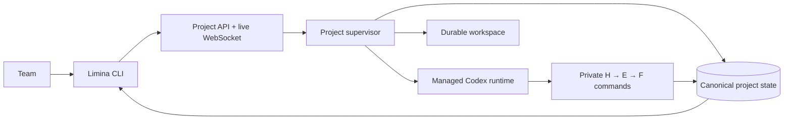

```
  ██╗     ██╗███╗   ███╗██╗███╗   ██╗ █████╗
  ██║     ██║████╗ ████║██║████╗  ██║██╔══██╗
  ██║     ██║██╔████╔██║██║██╔██╗ ██║███████║
  ██║     ██║██║╚██╔╝██║██║██║╚██╗██║██╔══██║
  ███████╗██║██║ ╚═╝ ██║██║██║ ╚████║██║  ██║
  ╚══════╝╚═╝╚═╝     ╚═╝╚═╝╚═╝  ╚═══╝╚═╝  ╚═╝

  from Latin līmen — "threshold"
  Cross the boundary between known and unknown.
```

[](https://opensource.org/licenses/Apache-2.0)
[](https://github.com/theam/limina/stargazers)
[](https://github.com/theam/limina/network/members)

Limina is a collaborative runtime for long-running, evidence-driven work with Codex.

Give a Limina project a mission, success criteria, context, variables, and secrets. Limina owns
the Codex runtime, keeps the work running across interruptions, persists the knowledge it produces,
and gives your team one CLI for reviewing and steering it together.

You operate projects. Limina operates sessions, threads, subagents, leases, retries, workspaces,
and recovery.

## Quick start

You need Docker, an OpenAI API key, and [`uv`](https://docs.astral.sh/uv/) for the host CLI.

Clone the repository and install the CLI:

```bash
git clone https://github.com/theam/limina.git
cd limina
uv tool install .
```

Create `.env` with the credentials for your Limina instance:

```dotenv
OPENAI_API_KEY=...
LIMINA_API_TOKEN=replace-with-a-long-random-value
```

Start the complete server with one Docker command:

```bash
docker compose up --build
```

The container applies its database migrations and starts the managed runtime. Its named
`limina-data` volume preserves the database, project workspaces, and local secret-encryption key.

Open another terminal and configure the CLI:

```bash
export LIMINA_API_TOKEN=replace-with-the-same-value
export LIMINA_ACTOR=adrian

limina doctor
```

`LIMINA_URL` defaults to `http://127.0.0.1:7433`.

## Create your first project

```bash
limina project create retrieval \
  --name "Multilingual retrieval" \
  --mission "Improve multilingual product retrieval" \
  --success "Increase held-out NDCG by 10% without a P95 latency regression" \
  --context "The current baseline combines BM25 with embeddings"
```

A project is a durable instance of a mission. Creating it records the brief; execution begins only
when you start it.

### Provide variables and secrets

Variables are visible configuration and resource references:

```bash
limina resource variable retrieval SOURCE_REPO_URL https://github.com/acme/search
limina resource variable retrieval EVAL_SET_URI s3://research/eval-v3.parquet
```

Secrets are write-only. Read them from your environment, standard input, or a hidden interactive
prompt—never place a secret value in the command itself:

```bash
limina resource secret retrieval GITHUB_TOKEN --from-env GITHUB_TOKEN
printf '%s' "$AWS_SESSION_TOKEN" | \
  limina resource secret retrieval AWS_SESSION_TOKEN --from-stdin
limina resource secret retrieval SERVICE_API_KEY
```

```bash
limina resource list retrieval
```

Secret resource values are encrypted before persistence, never returned by the public API,
exact-value redacted from managed runtime events and decisions, and injected only into that
project's Codex environment. The runtime also instructs Codex never to print or persist them.

### Start the mission

```bash
limina start retrieval
limina status retrieval
```

Limina now owns the execution loop. You can close the terminal without stopping the project.

## Collaborate with your team

Every teammate connects to the same Limina instance and sets an identity for attribution:

```bash
export LIMINA_URL=https://limina.example.com
export LIMINA_API_TOKEN=...
export LIMINA_ACTOR=maya
```

### Watch durable activity

```bash
limina watch retrieval
```

`Ctrl-C` stops watching. It does not stop the project. Activity is persisted and can be replayed
from an event cursor.

### Steer asynchronously

```bash
limina steer retrieval \
  "Compare against the strongest cross-encoder baseline before drawing a conclusion."

limina steer retrieval \
  'Approved to spend up to $100 on the larger evaluation.' \
  --kind APPROVAL
```

Guidance is committed before delivery. It reaches the active Codex turn immediately when possible
and remains queued durably otherwise.

### Enter the live project

```bash
limina attach retrieval
```

`attach` shows the current state, follows live activity, and accepts direct feedback:

```text
limina> Prioritize generalization over a benchmark-specific improvement.
limina> /pause
limina> /resume
limina> /interrupt
limina> /detach
```

Plain text steers the active turn. `/detach` only leaves the live view; Limina keeps working.
Multiple teammates can attach simultaneously and see the same attributed event history.

## Review the work and knowledge

```bash
limina review retrieval
limina review retrieval --artifact H001
limina review retrieval --artifact E003
limina review retrieval --artifact F002
```

Limina maintains an evidence chain:

```text
Hypothesis → Experiment → Finding
```

An experiment cannot exist without a hypothesis, and a finding cannot exist without a completed
experiment. Observations are append-only; IDs are allocated atomically; experiment writes are
scoped; and stale decisions are rejected instead of overwriting newer knowledge.

Export a deterministic Markdown projection whenever you want an offline review or archive:

```bash
limina export retrieval ./retrieval-kb
```

The database remains canonical while the project is running. Markdown and Git are review and
portability surfaces, not the live coordination mechanism.

## Project lifecycle

```bash
limina project list
limina project show retrieval

limina pause retrieval
limina resume retrieval
limina stop retrieval
limina project archive retrieval
```

- `pause` interrupts active work safely and keeps the project resumable.
- `resume` continues a paused, waiting, stopped, or failed project.
- `stop` ends execution without deleting history or knowledge.
- `archive` removes an inactive project from the default project list without deleting it.

## Command overview

| Command | Purpose |
|---|---|
| `limina project create/list/show/archive` | Manage durable project instances |
| `limina start/pause/resume/stop` | Control project lifecycle |
| `limina status` | See the current objective, next step, blocker, and progress |
| `limina resource variable/secret/list/remove` | Manage project-scoped access |
| `limina watch` | Follow the durable activity stream |
| `limina steer` | Send durable feedback, answers, approvals, or blockers |
| `limina attach` | Watch and steer the active project interactively |
| `limina review` | Review hypotheses, experiments, findings, and evidence |
| `limina export` | Produce a portable Markdown knowledge base |
| `limina doctor` | Verify connectivity and authentication |

Run `limina --help` or `limina <command> --help` for the complete interface.

All non-interactive commands support global JSON output:

```bash
limina --json status retrieval | jq '.project.status'
limina --json review retrieval | jq '.findings[] | {id, title}'
```

## How Limina owns the runtime



Each active project has one Limina-owned supervisory loop. The loop creates or resumes the private
Codex thread, injects only that project's resources, streams selected activity, checkpoints
progress, and recovers automatically after process restarts.

The public CLI and OpenAPI deliberately expose no worker, session, thread, subagent, lease, version,
or checkpoint controls.

## Deployment modes

### Single instance

The default `compose.yaml` runs one Limina container with SQLite and a persistent Docker volume:

```bash
docker compose up --build
```

This is the simplest deployment for a team sharing one server.

### PostgreSQL

Use the PostgreSQL topology when you need managed database operations or plan to run multiple
runtime replicas:

```bash
docker compose -f compose.cloud.yaml up --build
```

PostgreSQL coordinates atomic artifact IDs, project ownership, scoped experiment writes,
compare-and-swap decisions, idempotent mutations, and ordered human guidance.

## Security and production boundary

The default instance uses bearer-token authentication and a locally generated Fernet key. The key
is stored with restrictive permissions in the persistent volume. Resource records, command
receipts, API responses, and runtime events never intentionally contain the plaintext value. This
does not protect against an attacker who obtains the entire volume together with its key.

Before exposing Limina to an untrusted network:

- terminate the API behind TLS;
- replace the shared bearer token with OIDC and project-level RBAC;
- provide `LIMINA_SECRET_KEY` from a secrets manager;
- isolate project workspaces with containers or microVMs;
- add quotas, audit export, object storage, and operational telemetry.

For the implemented threat model and recovery behavior, read the
[architecture decision](docs/cloud-runtime-architecture.md).

## Development

Install the application and Codex runtime dependencies:

```bash
uv sync --extra codex
```

Run the complete acceptance suite:

```bash
make runtime-check
```

Run a local development server without Docker:

```bash
export OPENAI_API_KEY=...
export LIMINA_API_TOKEN=local-secret
uv run limina serve
```

Additional documentation:

- [CLI workflow](docs/cloud-runtime-cli.md)
- [Architecture and concurrency model](docs/cloud-runtime-architecture.md)
- [Verification evidence](docs/cloud-runtime-evidence.md)

## Contributing

- [Open an issue](https://github.com/theam/limina/issues) for bugs and feature requests.
- [Start a discussion](https://github.com/theam/limina/discussions) for questions and design ideas.

Built by [The Agile Monkeys](https://theagilemonkeys.com).

## License

Apache 2.0, © The Agile Monkeys. See [LICENSE](./LICENSE).
