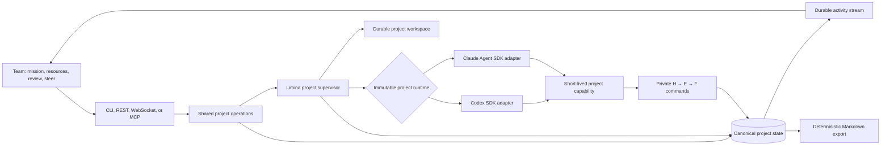
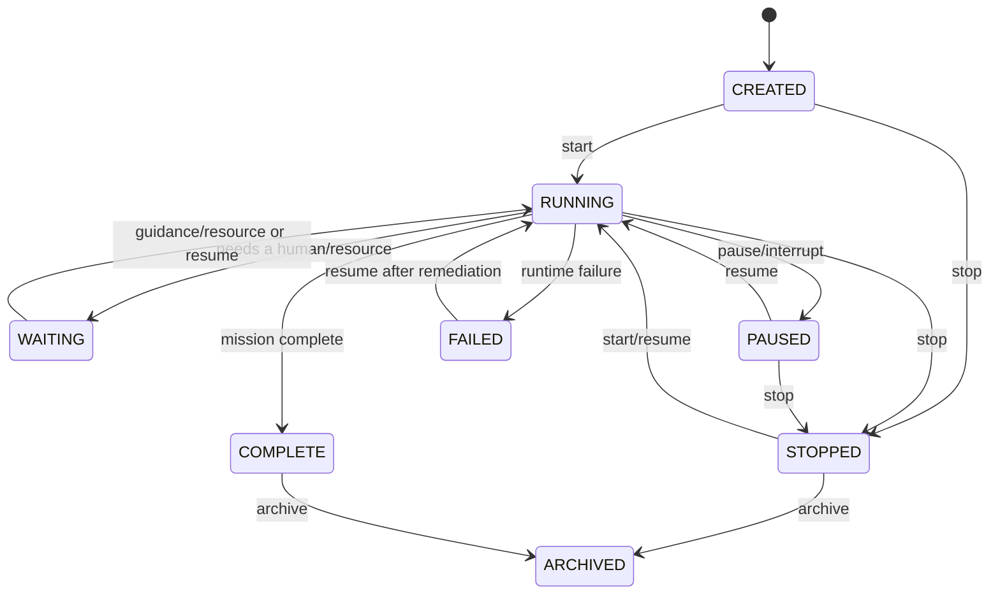

# Limina managed runtime: architecture decision

## Decision

Limina owns the runtime, not only the knowledge database.

One Limina project owns a mission, one immutable runtime choice, a durable research graph, an
isolated workspace, a private resumable continuation, an asynchronous guidance inbox, and one
supervised execution loop. The runtime may be `codex` or `claude-code`. Users operate the project;
only Limina operates turns, sessions, subagents, checkpoints, leases, retries, and recovery.

## Human contract

The complete public contract is:

1. create, start, pause, resume, stop, archive, and inspect projects;
2. provide the mission, success criteria, context, variables, and secrets;
3. choose Codex or Claude Code when a project is created;
4. review accepted work and knowledge;
5. give feedback, answer questions, approve decisions, and steer strategy;
6. attach to a live project to watch and steer current work synchronously.

The public OpenAPI schema, MCP tools/resources, and CLI expose no worker, session, thread,
subagent, lease, checkpoint, version, or inbox-cursor controls. Provider session IDs are stored as
private `continuation_id` state so the rest of Limina does not depend on either provider's
terminology.

## Public transport boundary

REST is the canonical machine contract, the CLI is its human terminal client, WebSocket adds a
live view, and MCP is an agent-native adapter. Both REST and MCP call one `ProjectOperations`
layer, so lifecycle side effects, durable guidance, resource refreshes, public projections, and
redaction rules cannot diverge by transport.

The MCP endpoint uses stateless Streamable HTTP at `/mcp/`. It carries the same bearer token as
REST. Local development may use one shared token and `X-Limina-Actor`; team deployments validate
OIDC/JWT signatures, issuer, audience, expiry, and required claims, then use the signed subject for
project RBAC. Caller-supplied actor headers cannot override OIDC identity. MCP JSON-RPC request
identity is not treated as a permanent idempotency namespace; tools accept an optional stable
idempotency key, and otherwise generate a command ID. Read-only MCP resources project lists, status,
reviews, H/E/F knowledge, and deterministic Markdown snapshots.

Secret values are intentionally absent from MCP tools because their arguments normally enter a
model context or transcript. A trusted CLI or direct REST client may set encrypted, write-only
secrets; MCP can inspect redacted secret metadata and revoke a secret by name. DNS-rebinding
protection accepts local hosts by default and requires an explicit host/origin allowlist for a
remote deployment.

## Engine boundary

The project supervisor depends on a small internal runtime contract:

- run a managed turn in a workspace from an optional continuation;
- stream sanitized runtime activity;
- persist a new continuation before relying on it;
- steer or interrupt active work;
- return one structured project checkpoint;
- close provider resources during shutdown.

Both adapters satisfy that contract, so lifecycle, durable guidance, knowledge writes, leases,
redaction, and recovery are provider-independent.

| Behavior | Codex | Claude Code |
|---|---|---|
| SDK | `openai-codex` Python SDK | `claude-agent-sdk` Python SDK |
| Continuity | Codex thread ID | Claude session ID |
| Structured checkpoint | turn JSON output schema | SDK JSON-schema output format |
| Active steering | steer the current turn | interrupt response, then query the same session with guidance |
| Pause/stop | interrupt active turn | interrupt active response |
| Activity | selected turn/item notifications | selected assistant/tool/task messages |
| Private state | persisted before/at turn execution | persisted as soon as SDK messages expose the session ID |

The runtime is editable during `CREATED` kickoff and immutable after the first start. Switching a
live research graph from one provider
continuation model to another would make recovery ambiguous and invalidate behavioral comparisons.
An engine comparison should be two projects with independent histories and explicit evidence.

### Codex adapter

The official [Codex SDK](https://developers.openai.com/codex/sdk/) supports starting and resuming
threads. Its [app-server protocol](https://developers.openai.com/codex/app-server/) exposes turn
events, steering, and interruption. Limina creates or resumes the private thread, persists its ID
before tools run, supplies a JSON output schema, streams selected notifications, and uses the
active turn handle for steering and lifecycle interruption. In the Docker image, `CODEX_HOME` is
stored on the Limina volume so local thread data survives container replacement.

### Claude Code adapter

The official [Claude Agent SDK for Python](https://platform.claude.com/docs/en/agent-sdk/python)
supports persistent `ClaudeSDKClient` sessions, resume, interrupt, tool permission callbacks, and
structured outputs. Limina uses the SDK's bundled Claude Code CLI, stores its private config below
the Limina volume, disables user/project setting inheritance, enables sandboxing, and persists the
session ID as the provider-neutral continuation.

Claude's interrupt API stops the current response rather than injecting text into that response.
Therefore a live Limina steer is implemented as an interrupt followed immediately by a new query
on the same connected session containing all steering that arrived. The project remains one
continuous Claude session; users do not manage that transition.

Claude Code may clean old local session data by default. Limina writes a private SDK settings file
with a long cleanup period and keeps `CLAUDE_CONFIG_DIR` on the durable volume. The database still
owns the checkpoint and session pointer; the provider transcript is supporting continuation state,
not the canonical knowledge base.

## State ownership

PostgreSQL is the canonical live state. The default single-node deployment uses the same schema on
SQLite. Markdown is a deterministic read/export projection, and Git is an optional review/archive
destination.

The database owns:

- project mission, immutable runtime choice, lifecycle, and current objective;
- project membership and `OWNER`/`EDITOR`/`VIEWER` authorization;
- the H → E → F research graph and immutable revisions;
- append-only experiment observations;
- visible variables and encrypted secrets;
- asynchronous guidance and acknowledgement;
- URLs, connectors, bounded uploads, comments, tags, explicit relations, and saved views;
- a monotonic attributed event stream;
- structured runtime runs, tool counts, provider usage, failures, and analytics inputs;
- private provider continuation state and runtime leases;
- idempotency receipts for every mutation.

Variables cover URLs, paths, flags, and visible configuration. Secrets are encrypted before
database persistence and omitted from public API responses, command receipts, events, reviews, and
prompts. Both become environment variables only for the selected managed runtime turn. Resource
rotation and revocation are queued durably, interrupt active work, discard its stale checkpoint,
and restart the turn with a newly materialized child environment.

The workspace owns checked-out repositories, generated artifacts, code, and experiment files. It
lives independently of any one turn or process. Large evidence should live in object storage with
its URI represented in the research graph.

## Parallelism and knowledge writes

Project strategy and evidence production have different coordination requirements; they should
not share one global lock.

| Scope | Coordination rule | Why |
|---|---|---|
| Project strategy | One renewable coordinator lease | Prevents contradictory top-level mission decisions. |
| New H/E/F IDs | Atomic counter per project and kind | Concurrent creators receive distinct monotonic IDs. |
| Independent experiments | Lease per `E###` | Different experiments may run in parallel; one experiment has one writer. |
| Observations | Append-only rows | Parallel evidence does not rewrite a shared document. |
| Decisions/completion | Compare-and-swap on artifact version | Stale synthesis cannot overwrite newer knowledge. |
| Guidance/events | Append-only sequence | Teammates retain stable ordering and attribution. |
| Export | Rebuild from a committed snapshot | Export does not participate in live locking. |

Either provider may use subagents internally. A subagent lane can identify itself with
`LIMINA_AGENT_LANE`; its short-lived capability remains scoped to one project while experiment
leases remain lane-specific. Strategy is serialized at the top level, while independent evidence
production may proceed in parallel.

This is why Git is not the canonical write path. Git cannot atomically express “complete E004 only
if it is still version 3 and this lane still owns its lease.” A relational transaction can. Git
remains useful after the transaction as a reviewable projection.

## Synchronous and asynchronous steering

Every message is committed to the durable guidance inbox before Limina attempts live delivery.

- For Codex, Limina calls the active turn's steer operation.
- For Claude Code, Limina interrupts the active response and immediately redirects the same SDK
  session with the accumulated guidance.
- If no turn is active, the pending message wakes a waiting project and enters the next prompt.
- `limina attach` opens a project WebSocket, replays durable events, and multiplexes live events
  with terminal input.
- Multiple attached users see one persisted event order. Input is attributed and sequenced by the
  database, not by connection timing.
- `/interrupt` pauses the project after interrupting active work. Disconnecting only detaches the
  viewer.

Live delivery is best-effort on top of durable acceptance because an external model stream cannot
join the database transaction. A failure at the boundary may replay a message, so prompts and
knowledge commands are designed to tolerate at-least-once guidance.

## Lifecycle and recovery

The server lifespan starts the MCP request manager and the project supervisor. Startup scans
`RUNNING` and `WAITING` projects and reconstructs their loops. A turn:

1. acquires and renews the project coordinator lease;
2. snapshots mission, state, resources, and pending guidance;
3. selects the project's immutable runtime adapter;
4. creates or resumes its private continuation and persists that pointer;
5. issues a short-lived, project-scoped capability for research commands;
6. runs and streams the managed turn in the durable workspace;
7. validates a provider-independent structured checkpoint;
8. commits objective, status, and guidance acknowledgements atomically;
9. revokes the capability and releases the coordinator lease.

If the process dies, accepted knowledge writes and guidance remain. A replica may take the lease
after expiry and resume from the provider continuation and canonical checkpoint. A heartbeat
prevents lease expiry during long turns; lease loss interrupts work rather than accepting a stale
checkpoint.

## Security boundary

The child runtime does not receive the database URL or Limina administrative token. It receives a
random, short-lived capability restricted to one active project. Project variables and decrypted
secrets are copied into that turn only. Reserved control-plane and provider credential names cannot
be replaced by project resources.

Both adapters construct allow-listed child environments and explicitly blank unapproved inherited
values because provider SDKs launch subprocesses from the control-plane process. Exact resource
values are redacted from streamed events, structured decisions, and adapter error details.

Claude Code additionally receives a private `CLAUDE_CONFIG_DIR`, subprocess environment scrubbing,
no inherited setting sources, and a permission callback that constrains direct file tools to the
project workspace. The image installs the Linux sandbox dependencies, requires sandbox startup to
succeed, disables unsandboxed commands, and denies Bash read access to Limina's state root while
re-allowing the active workspace. The weaker nested-sandbox mode is enabled only by the Docker
image, whose outer container is the additional boundary. Codex uses the selected SDK sandbox
profile; the default is `workspace-write` with network access.

The reference instance encrypts secrets with a persistent Fernet key. In single-container mode the
key is generated with restrictive permissions inside `limina-data`. Replicas must receive one
shared `LIMINA_SECRET_KEY` from a secrets manager. Losing the key makes existing secrets
unrecoverable by design.

The co-located key protects against plaintext in database queries, exports, logs, or an isolated
database backup; it does not protect an attacker with the complete volume and key. Local
development may use one shared bearer token. Team deployments use OIDC/JWT with exact issuer and
audience validation, JWKS key rotation, server-derived identity, and database-backed project roles.
Browser live attachment uses short-lived, single-use, project-scoped tickets stored only as hashes.
An internet-facing deployment still needs TLS, an external secret manager, and stronger per-project
container or microVM isolation.

## Stack

| Concern | Choice |
|---|---|
| Runtime and domain | Python 3.11+, typed service layer |
| Codex | Official `openai-codex` Python SDK |
| Claude Code | Official `claude-agent-sdk` Python SDK with bundled CLI |
| Public control/live transport | FastAPI REST + WebSocket; official MCP Python SDK for Streamable HTTP |
| CLI | Typer, Rich, `websockets` |
| Canonical persistence | PostgreSQL + SQLAlchemy 2 |
| Knowledge retrieval | PostgreSQL full-text search + explicit graph; SQLite substring fallback |
| Schema evolution | Alembic |
| Local/single-node storage | SQLite WAL |
| Packaging | `uv`, locked `pyproject.toml` |
| Default deployment | One runtime image + persistent SQLite volume |
| Scale-out deployment | The same runtime image + PostgreSQL |

Python keeps the supervisor and both official SDK adapters in one process model, while the adapter
contract prevents provider details from leaking into the product interface.

## Production layers still required

The branch implements the application boundary, OIDC/RBAC, browser-safe live access, native run
observability, analytics, full-text knowledge query, collaboration metadata, and a one-command team
deployment. Before untrusted multi-tenant exposure, add a secrets manager, per-project sandbox
containers or microVMs, external object storage, quotas, audit export, infrastructure traces, and a
transactional outbox.

For horizontal replicas, PostgreSQL leases already prevent duplicate top-level turns. An external
workflow scheduler may later improve timers and operations, but it must remain an internal Limina
component rather than becoming the owner of provider sessions.
