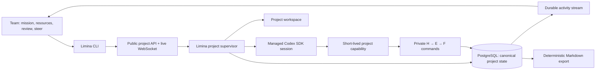
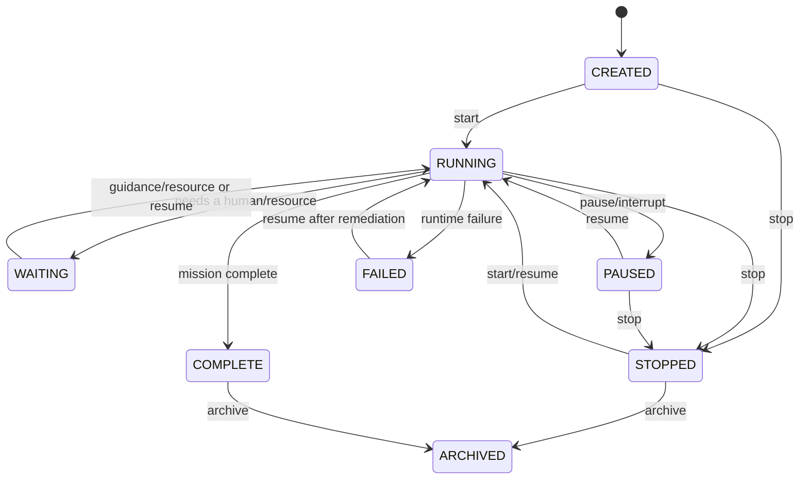

# Limina cloud runtime: architecture decision

## Decision

Limina is the runtime, not a database beside somebody else's runtime.

One Limina project owns a mission, a durable research graph, an isolated workspace, a resumable
Codex thread, an asynchronous guidance inbox, and one supervised execution loop. Users operate
the project. Only Limina operates turns, sessions, subagents, checkpoints, leases, retries, and
thread recovery.

## Product boundary

The complete human contract is:

1. create, start, pause, resume, stop, archive, and inspect projects;
2. provide the mission, success criteria, context, variables, and secrets;
3. review accepted work and knowledge;
4. give feedback, answer questions, approve decisions, and steer strategy;
5. attach to a live project to watch and steer the current work synchronously.

The public OpenAPI schema and CLI deliberately contain no worker, session, thread, subagent,
lease, checkpoint, version, or inbox-cursor controls. Those concepts exist only behind the Limina
runtime boundary.

## Why the Codex SDK is behind Limina

The official [Codex SDK](https://developers.openai.com/codex/sdk/) is intended for embedding
Codex in internal applications and supports continuing or resuming threads. The underlying
[app-server protocol](https://developers.openai.com/codex/app-server/) streams turn/item events,
accepts `turn/steer` during an active turn, and supports `turn/interrupt`. The Python SDK exposes
those operations through its turn handle, so Limina can provide a project-level experience while
keeping Codex lifecycle details private.

This implementation uses the official Python SDK adapter. It persists a newly created thread ID
before tools execute, resumes that thread on later checkpoints, streams selected SDK notifications
into Limina's event log, sends live feedback through the active turn handle, and interrupts the
turn for pause/stop operations.

## State ownership

PostgreSQL is the canonical live state. Markdown is a deterministic read/export projection, and
Git is an optional review/archive destination.

The database owns:

- project mission, lifecycle, and current objective;
- the H → E → F research graph and immutable revisions;
- append-only experiment observations;
- visible project variables and encrypted project secrets;
- asynchronous human guidance and acknowledgement;
- a monotonic attributed event stream;
- private SDK continuity and runtime leases;
- idempotency receipts for every mutation.

Variables cover URLs, paths, flags, and other visible configuration. Secrets are encrypted before
they enter the database and are redacted from API responses, command receipts, events, reviews,
and prompts. Both are materialized as environment variables only for the managed project turn.

The workspace owns code, checked-out repositories, generated artifacts, and experiment files. A
project workspace lives independently of any one turn or process. Object storage is the natural
next backing store for large evidence; its URI belongs in the research graph.

## Parallelism and KB writes

There are two different coordination problems and they should not share one global lock.

| Scope | Coordination rule | Why |
|---|---|---|
| Project strategy | One renewable coordinator lease | Prevents two top-level turns from making contradictory mission decisions. |
| New H/E/F IDs | Atomic counter per project and kind | Concurrent creators get distinct monotonic IDs. |
| Independent experiments | Lease per `E###` | Different experiments can run in parallel; the same experiment cannot have competing owners. |
| Observations | Append-only rows | Parallel evidence does not rewrite a shared document. |
| Decisions/completion | Compare-and-swap on artifact version | Stale synthesis fails instead of overwriting newer knowledge. |
| Human guidance/events | Append-only sequence | Multiple teammates retain a stable total order and attribution. |
| Export | Rebuild from a committed snapshot | Export never participates in live locking. |

Codex may use subagents internally. A subagent lane can identify itself with
`LIMINA_AGENT_LANE`; the project capability remains scoped to one project while experiment leases
remain lane-specific. Strategy stays serialized at the top level, but evidence production is
parallel wherever the graph says it is independent.

This is the core answer to parallel KB writes: serialize semantic transitions, not files. Git
cannot atomically express “complete E004 only if it is still version 3 and this lane still owns its
lease.” PostgreSQL can. Git remains useful after the transaction as a reviewable projection.

## Synchronous and asynchronous steering

Every steering message is committed to the durable guidance inbox first.

- If a Codex turn is active, Limina also calls the SDK's live steer operation and records the
  message for acknowledgement in that turn's checkpoint.
- If no turn is active, the message remains pending and wakes a waiting project.
- `limina attach` opens a project WebSocket, replays durable events, then multiplexes live events
  and terminal input.
- Multiple attached users see the same persisted event order. Their input is attributed and
  sequenced by the database, not by whichever WebSocket happens to arrive first.
- `/interrupt` interrupts the active turn and pauses the project. Disconnecting only detaches the
  viewer; it does not stop Limina.

Delivery is durable even when “live” delivery is unavailable. Live steering is intentionally
best-effort on top of durable inbox acceptance because no external model stream can participate in
the database transaction.

## Runtime lifecycle and recovery

The API process starts the project supervisor in its lifespan. Startup scans for `RUNNING` and
`WAITING` projects and reconstructs their loops. A turn:

1. acquires and renews the project coordinator lease;
2. snapshots mission, active state, resources, and pending guidance;
3. creates or resumes the private Codex thread and persists its ID immediately;
4. issues a short-lived, project-scoped capability for private research commands;
5. runs and streams the Codex turn in the project workspace;
6. validates a structured runtime decision;
7. commits the new objective/status and guidance acknowledgements atomically;
8. revokes the capability and releases the coordinator lease.

If the process dies, accepted KB writes and guidance remain. Another Limina replica may take the
lease after expiry and resume from the persisted thread/checkpoint. A heartbeat prevents lease
expiry during a long turn.

## Security boundary

The Codex child process does not receive the PostgreSQL URL or the Limina administrative token.
It receives a random, short-lived capability restricted to one active project. The capability is
revoked after the turn. Project variables and decrypted secrets are copied into that turn only;
reserved process and control-plane names cannot be overridden.

The reference instance encrypts secrets with a persistent Fernet key. The single-container mode
generates that key with restrictive file permissions inside the durable `limina-data` volume. A
multi-replica deployment must provide the same `LIMINA_SECRET_KEY` to every replica from a secret
manager. Losing the key makes existing secrets intentionally unrecoverable.

The co-located key in single-container mode protects against plaintext appearing in database
queries, exports, logs, or an isolated database backup; it does not protect an attacker who gains
the entire Docker volume. Internet-facing and multi-host deployments should always supply the key
from an external secret manager.

The prototype public API uses one bearer token and trusts the supplied actor for attribution. A
production team deployment should replace that edge with TLS plus OIDC/JWT, derive actor identity
server-side, add project-level roles, use a secrets manager, and isolate project workspaces at the
container or microVM boundary. The internal capability model remains useful behind that edge.

## Stack

| Concern | Choice |
|---|---|
| Runtime and domain | Python 3.11+, typed service layer |
| Codex | Official `openai-codex` Python SDK |
| Public control/live transport | FastAPI HTTP + WebSocket |
| CLI | Typer, Rich, `websockets` |
| Canonical persistence | PostgreSQL + SQLAlchemy 2 |
| Schema evolution | Alembic |
| Local tests/development | SQLite WAL |
| Packaging | `uv`, locked `pyproject.toml` |
| Default deployment | One runtime container + persistent SQLite volume |
| Scale-out deployment | One runtime image + PostgreSQL |

Python is the pragmatic choice because Limina's validator and KB tooling already use it and the
official Codex Python SDK now exposes the required runtime primitives. A future rich GUI may use
app-server directly inside the adapter, but it should not change the project-level public model.

## Deliberate next production layers

The branch implements the application boundary and a one-command single-instance deployment.
`docker compose up --build` starts the complete server; the PostgreSQL Compose file remains the
scale-out reference. Before
multi-tenant internet exposure, add OIDC/RBAC, a secret manager, per-project sandbox containers or
microVMs, durable object storage, quotas, audit export, metrics/traces, and a transactional outbox.
For horizontal replicas, PostgreSQL leases already prevent duplicate top-level turns; an external
workflow scheduler can later improve timers and operational visibility without becoming the owner
of Codex sessions.
