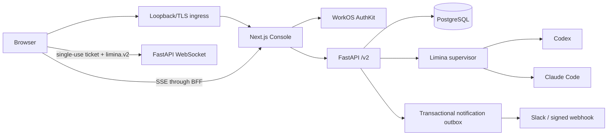

# Limina Console

Limina Console is the human control plane for the Limina managed runtime. It is intentionally not
an executor terminal and does not expose provider sessions, subagents, checkpoints, leases, or raw
runtime credentials. Operators frame work, review evidence, answer requests, and steer outcomes;
Limina continues to own execution and the evidence invariants.

The complete product and engineering plan is
[`tasks/prd-limina-runtime-ui.md`](../tasks/prd-limina-runtime-ui.md). This guide describes the
implemented release candidate.

## Use cases delivered

1. **Start deliberately.** Create a draft from a mission, measurable success criteria, context, and
   a Codex or Claude Code executor. Review preflight before starting.
2. **Run several projects asynchronously.** Today ranks cross-project attention so the human sees
   decisions, failures, reviews, completion, and stalled work without watching every run.
3. **Steer at the right level.** Give proactive direction, answer a specific executor request,
   review a pinned evidence revision, or apply a server-advertised lifecycle action.
4. **Audit the evidence.** Browse H/E/F knowledge, revisions, tags, comments, reviews, run attempts,
   sanitized activity, and provenance without entering the private agent protocol.
5. **Operate safely.** Manage project members, sources, visible variables, write-only secrets, and
   notification destinations through explicit capabilities.
6. **Respond away from the desk.** Slack or signed generic webhooks carry concise, sanitized
   summaries and deep-link back to the authoritative Console action.

## How an operator steers an executor

Steering is expressed as durable product intent, never as manipulation of a provider thread:

| Human action | Console surface | Runtime effect |
|---|---|---|
| Answer, select, confirm, or reject | Today / attention detail | Atomically resolves the singular request, writes durable guidance, and wakes the project |
| Review a finding | Knowledge detail | Pins an outcome and rationale to the exact artifact revision; resolves a matching executor review request and wakes it with the decision |
| Give proactive direction | Project overview or Live | Commits a typed steering message before attempting immediate delivery; queued guidance survives disconnects |
| Pause, resume, stop, start, archive | Project overview or Live | Applies only actions advertised by the server for the member role and current lifecycle state |
| Acknowledge or snooze | Today | Completion acknowledgement and snoozes are personal; a failed-run acknowledgement closes that exact failure project-wide until a later run changes the source |

The backend remains authoritative for role and state. The Console does not compare project role
strings to invent permissions; it renders returned capabilities and `allowed_actions`. A viewer may
acknowledge project completion or snooze a personal stalled/unattended notice. Editors can steer
and resolve project work. Notification-failure acknowledgement and administrative changes require
an Owner.

`unattended_run` is informational and snoozable in this release candidate. It does not
automatically stop an executor.

## Product shape

- **Today / the Desk:** a compact attention queue and contextual action rail.
- **Projects:** sortable project situation and lifecycle summary.
- **Kickoff:** four-stage mission, runtime, input, and preflight flow.
- **Overview:** current objective, next step, blocker, evidence counts, and recent activity.
- **Knowledge:** searchable H/E/F list and evidence reader with revision-pinned review.
- **Runs:** attempt lineage, normalized failure state, duration, usage provenance, and sanitized
  events.
- **Live:** bounded attached activity plus immediate steering; mobile keeps Today/request resolution
  and deliberately hides the dense steering workspace.
- **Settings:** draft editing, inputs, WorkOS organization members, write-only secrets,
  notifications, cloning, and instance health.

The visual implementation follows `theam/brand-system` TAM-50 (`@theam/brand-system@0.2.6`): IBM
Plex Sans and Mono, square writing inputs, restrained `r4` panels, no shadows, no pill buttons
outside status tags, Carbon icons, semantic accent use, and the linked TAM initiative signature.
The exact tier decision is in [`apps/web/tam-decision.yml`](../apps/web/tam-decision.yml).

## Architecture



- Public clients use only `/v2`; there is no public `/v1` compatibility layer.
- `/internal/v1` is a separately authenticated, private executor-capability protocol.
- WorkOS access tokens stay in server code. Browser JavaScript receives neither bearer tokens nor
  webhook credentials.
- Global activity uses replayable SSE with heartbeat and resync semantics. Attached Live uses a
  one-use, short-lived project ticket carried in the WebSocket subprotocol, not a URL.
- Attention requests, reviews, dispositions, members, run history, and notification delivery are
  durable. In-process brokers accelerate delivery but are not the source of truth.
- A runtime-owned reconciliation pass scans active projects every 30 seconds, so derived failures,
  stalls, completions, preflight issues, and unattended runs materialize and notify even when no
  browser is open. A later run clears an earlier run failure; archived or terminal projects expire
  unresolved executor requests.
- Generic webhooks are HTTPS-only, reject redirects and private/non-global addresses, and connect
  to a DNS-validated pinned address while preserving the original host for TLS verification.

## Run locally

The Console stack is separate from the lightweight `compose.yaml` CLI/runtime stack. It uses
PostgreSQL and is intentionally explicit about local authentication:

```bash
export NODE_AUTH_TOKEN="$(gh auth token)"
export LIMINA_UI_AUTH_MODE=local
export LIMINA_ALLOW_LOCAL_AUTH=1
export LIMINA_CONSOLE_DEV_AUTH=1
export LIMINA_DEV_JWT_SECRET="$(openssl rand -hex 32)"
docker compose -f compose.cloud.yaml up --build
```

Open <http://127.0.0.1:7433>. Local auth is accepted only on a loopback Console origin and a
production Next.js process additionally requires `LIMINA_ALLOW_LOCAL_AUTH=1`. The default local
identity has `limina:access` and `limina:project-create`, not instance-admin authority.

## Configure WorkOS

Use a dedicated WorkOS client and organization. At minimum configure:

```dotenv
LIMINA_UI_AUTH_MODE=workos
WORKOS_API_KEY=sk_...
WORKOS_CLIENT_ID=client_...
WORKOS_COOKIE_PASSWORD=replace-with-at-least-32-random-characters
NEXT_PUBLIC_WORKOS_REDIRECT_URI=https://limina.example.com/callback
LIMINA_WORKOS_ORGANIZATION_ID=org_...
# Optional for a non-default WorkOS API host:
# LIMINA_WORKOS_API_HOSTNAME=api.workos.com
```

Do not set `LIMINA_ALLOW_LOCAL_AUTH` or `LIMINA_CONSOLE_DEV_AUTH` in this mode. The runtime pins the
exact WorkOS issuer/client, configured organization, signature key set, expiry, and permissions.
`limina:access` is mandatory. Owners search the configured organization server-side and select an
existing immutable WorkOS user; Limina does not invite or bind identities by email.

## Build and verification

```bash
uv sync --locked --all-extras --dev
uv run ruff format --check src migrations tests/test_cloud_*.py tests/test_console_*.py
uv run ruff check src migrations tests/test_cloud_*.py tests/test_console_*.py
uv run python -m unittest discover -s tests

cd apps/web
pnpm install --frozen-lockfile
pnpm contract:check
pnpm check:auth-boundary
pnpm typecheck
pnpm lint
pnpm test
pnpm test:e2e
```

CI repeats these gates, builds the production images, starts the full Compose topology, and runs
desktop/mobile Chromium journeys with keyboard and axe checks. Evidence and external proof gates
are tracked in [`console-release-evidence.md`](console-release-evidence.md).
