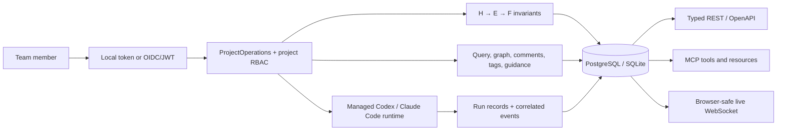

# UI-ready backend: implementation and rationale

## Outcome

Limina now exposes the backend contract for an observability, analytics, knowledge, steering, and
project-kickoff UI. The UI remains a client: it never owns provider sessions, runtime turns,
subagents, recovery, or knowledge-write invariants.

All public transports call `ProjectOperations`, which applies project authorization before
delegating to the research service, collaboration service, exporter, or runtime supervisor. REST,
WebSocket, MCP, and the CLI therefore cannot develop different lifecycle or authorization rules.

## Decisions

### Identity and authorization

Team mode uses provider-neutral OIDC discovery and JWT validation:

- exact issuer validation;
- configured audience validation;
- signature verification through the issuer's JWKS endpoint;
- expiration, issued-at, subject, issuer, and audience requirements;
- bounded clock-skew tolerance (30 seconds by default, configurable from 0 to 300);
- server-derived display name, subject, and e-mail;
- optional instance-administrator claim mapping.

This follows the OpenID Connect requirement that the configured issuer, discovery issuer, and JWT
`iss` value match exactly and that signing keys come from `jwks_uri`. See the
[OpenID Connect Discovery specification](https://openid.net/specs/openid-connect-discovery-1_0.html).

The shared token remains a local-development mode. In OIDC mode, Limina ignores
`X-Limina-Actor`; attribution cannot be spoofed by a client header.

Project roles are persisted in `project_members`:

| Capability | Viewer | Editor | Owner |
|---|---:|---:|---:|
| Read status, review, knowledge, runs, analytics, guidance | yes | yes | yes |
| Attach to live work read-only | yes | yes | yes |
| Steer, comment, tag, relate, configure sources/variables | no | yes | yes |
| Start, pause, resume, stop | no | yes | yes |
| Manage members, secrets, archive | no | no | yes |

Project creation and initial ownership are one database transaction. A project cannot be created
without its authenticated owner and then become inaccessible because of a process crash.

### Browser live access

Browsers cannot reliably set an `Authorization` header on the native WebSocket constructor. Limina
therefore issues a random project-scoped live ticket after normal bearer authentication. Only its
SHA-256 hash is stored. The ticket expires within 60 seconds by default and is consumed exactly
once under a row lock. It carries the already-authorized subject and role, so a viewer can watch but
cannot steer.

This avoids long-lived access tokens in query strings while remaining compatible with multiple
API replicas. CLI clients may continue to use the WebSocket authorization header.

### Knowledge search and graph

PostgreSQL is the production query backend. The migration creates a GIN index over a multilingual,
non-stemming `simple` `tsvector` built from title and JSON payload text. Queries use
`websearch_to_tsquery`, which accepts
raw user-style terms, phrases, `OR`, and negation without raising syntax errors. See the
[PostgreSQL full-text search controls](https://www.postgresql.org/docs/current/textsearch-controls.html)
and [table/index guidance](https://www.postgresql.org/docs/current/textsearch-tables.html).

SQLite uses a deterministic lowercase substring fallback for the one-container development mode.
Every response names the active search backend.

Semantic/vector retrieval is deferred. Full-text search first provides explainable ranking, an
index with no external embedding lifecycle, and a credible baseline. Explicit relations, evidence
chain edges, tags, backlinks, comments, revisions, and saved views provide graph navigation without
pretending vector similarity is a knowledge relation. A future vector backend can be evaluated
against this baseline and added behind the same paginated query contract.

Knowledge writes preserve the existing parallelism model:

- H/E/F IDs use atomic per-project counters;
- experiment work uses per-experiment leases;
- observations and comments are append-only;
- artifact decisions use compare-and-swap versions;
- tags use a composite primary key;
- explicit relations use a uniqueness constraint;
- saved views are independent rows;
- the project coordinator lease serializes strategy, not all knowledge writes.

There is no shared Markdown-file write lock because Markdown remains an export projection, not the
canonical live database.

### Runtime observability

Each managed turn creates a `runtime_runs` record before provider work begins. Provider events are
correlated with the run ID. Completion records:

- engine and model;
- running, completed, failed, or interrupted status;
- start, completion, and duration;
- tool-call count;
- normalized error code and message;
- private provider turn identifier retained internally for diagnosis;
- input, output, and cached tokens when exposed by the SDK;
- cost in micro-US dollars when exposed by the SDK.

Unavailable provider usage stays `null`; Limina does not estimate or fabricate it. Run detail and
event APIs are the product observability surface. Infrastructure traces and log export remain a
deployment concern rather than a substitute for project-level telemetry.

Analytics are computed from canonical run, artifact, and guidance rows. The API returns totals,
status distributions, success rate, average and P95 duration, tool and token totals, H/E/F
throughput, pending guidance, acknowledgement latency, and daily time-series buckets.

## Public API map

The generated OpenAPI document contains concrete response models rather than untyped top-level
objects.

| UI area | REST surfaces |
|---|---|
| Project kickoff | `POST/PATCH /v1/projects`, `/v1/project-templates`, `/preflight`, `/members`, `/sources`, `/resources` |
| Steering | `/steering`, `/guidance`, `/live-ticket`, `/live` WebSocket, lifecycle actions |
| Knowledge | `/knowledge`, `/knowledge/graph`, artifact detail, revisions, relations, comments, tags, saved views |
| Observability | `/events`, `/runs`, `/runs/{run_id}`, live WebSocket |
| Analytics | `/analytics` |
| Portability | `/snapshot` |

Projects, review knowledge, knowledge queries, guidance, events, and runs are bounded or paginated.
The review response returns one knowledge page plus its continuation cursor; larger explorations use
the dedicated knowledge query endpoint.

MCP exposes the same project boundary, including preflight, knowledge query/graph, guidance
history, runs, analytics, sources, and members. Secret values remain intentionally absent from MCP
arguments because those arguments normally enter a model-visible transcript.

## Kickoff resources

Kickoff supports three source types:

- `URL`: a visible HTTP(S) resource with embedded credentials rejected;
- `CONNECTOR`: a provider-neutral connector URI plus non-secret metadata, with embedded
  credentials rejected;
- `UPLOAD`: a size-bounded file stored inside the durable project workspace with original name,
  media type, size, and SHA-256 metadata.

Credentials remain separate write-only encrypted secrets. A source may refer to a secret by an
agreed environment-variable name without embedding the value in source metadata.

## Scale and failure behavior

- PostgreSQL row locks make live-ticket consumption and member ownership changes replica-safe.
- Existing coordinator and experiment leases preserve runtime and evidence-write exclusivity.
- Ordered durable events remain the replay transport; WebSocket delivery is an acceleration layer.
- Guidance is committed before delivery and acknowledged atomically with the accepted checkpoint.
- Run records survive provider failure and process interruption.
- The recent-review query reads the newest rows directly; it does not forward-scan and truncate at
  the first 1,000 events.

## Deliberate remaining deployment work

The application backend is ready for the described UI. An untrusted multi-tenant production
service still needs deployment choices that are intentionally outside the UI contract:

- TLS termination;
- external secret-key management;
- per-project container or microVM isolation;
- external object storage and malware scanning for large uploads;
- quotas, retention, audit export, and backup policy;
- infrastructure metrics/traces and a transactional outbox for very large replica fleets.

These do not require the UI to learn about Codex or Claude sessions and do not change the public
project contract.
