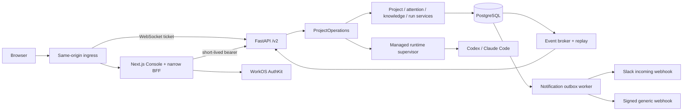

# PRD: Limina Console

- **Status:** Implemented; local acceptance complete, external provider/tenant proof pending
- **Date:** 2026-08-06
- **Authors:** Codex and Claude Code Opus 5, through independent proposals and reciprocal review
- **Product owner:** Adrián
- **Scope:** Product, UX, public API, architecture, and binding implementation contract.

## 1. Decision summary

This plan incorporates the leader's decisions:

| Decision | Approved direction |
|---|---|
| Public contract | `/v2` is the only public API. There is no public v1 compatibility surface. |
| Primary user | Research operator/lead. |
| Authentication | WorkOS AuthKit, following the proven structural pattern in `theam/tam-os`. |
| Notifications | Slack incoming webhooks and signed generic webhooks are launch scope. |
| Visual system | `@theam/brand-system@0.2.6`, TAM-50 proto rules. |
| Working posture | We are modifying Limina as meta-workers; this design work is not a Limina H→E→F run. |

The joint recommendation is to build **Limina Console**, an attention-first operations and evidence
workspace for autonomous research projects.

The product's primary loop is:

1. create and preflight a project;
2. leave it running without supervising a terminal;
3. return through the Console or a Slack deep link;
4. resolve an explicit request or steer proactively;
5. review the H→E→F evidence behind the result;
6. diagnose failures without seeing provider-private machinery.

The home screen is not a live-agent dashboard. It is a trusted queue of decisions, failures, and
reviews that need human attention. Live activity is an intentional project mode.

## 2. Problem and opportunity

Limina already owns durable execution, recovery, H→E→F knowledge, project authorization, guidance,
run telemetry, analytics, full-text search, and browser-safe live tickets. Its current interfaces are
CLI, REST, WebSocket, and MCP.

Those interfaces are sufficient for automation but impose too much reconstruction cost on a human
operator managing several projects. The operator must repeatedly answer five questions:

- Which project needs me now?
- What exactly is it asking for?
- What changed while I was away?
- Is the claimed evidence trustworthy?
- What action am I authorized to take safely?

The current backend cannot answer those questions cleanly for a UI because:

- `blocker` is mutable free text rather than an addressable request;
- there is no cross-project attention surface;
- artifact `content` and event `detail` are untyped dictionaries in public OpenAPI;
- project responses do not include the caller's role, capabilities, or state-valid actions;
- the browser live endpoint polls the database per connection;
- WorkOS access tokens do not match the current generic OIDC audience contract without deliberate
  integration work;
- no notification outbox, Slack adapter, or generic-webhook delivery model exists.

The opportunity is not merely to wrap existing endpoints. A versioned UI contract can turn Limina's
runtime capabilities into a coherent product while correcting these gaps.

## 3. Product thesis

> Limina's scarce resource is operator attention, not compute.

Limina exists so work continues when nobody is watching. Therefore:

- attention, not activity, is the front door;
- evidence, not model prose, is the trust surface;
- explicit requests and human reviews are durable product objects;
- the project, never a provider session, is the unit of operation;
- Slack delivers attention but never becomes a second control plane;
- an empty queue is trustworthy only when stream and notification freshness are visibly healthy.

## 4. Goals

1. Let an operator identify every project requiring action, and the safe next action, in under 30
   seconds.
2. Let an operator resolve most requests without reconstructing context in a terminal or opening a
   live session.
3. Make every reviewed finding traceable to its experiment, hypothesis, evidence, revision, and
   human review outcome.
4. Support the full create → preflight → start → monitor → intervene → review → diagnose loop from a
   browser.
5. Preserve Limina's provider-neutral project boundary and server-side authorization.
6. Make Slack and generic-webhook delivery durable, private, observable, and deep-linked back to the
   canonical request.
7. Preserve one-command self-hosted startup while introducing the web tier.
8. Establish a typed `/v2` contract suitable for generated clients and future CLI/MCP migration.

## 5. Non-goals

The first UI release will not include:

- raw provider transcripts, provider session IDs, threads, turns, subagents, continuations, leases,
  or checkpoints;
- direct human creation or editing of H/E/F artifacts;
- switching an engine after first start;
- a chat-style agent interface;
- a freeform knowledge-graph canvas;
- semantic/vector search;
- cost budgets, automated cost-based pausing, billing, or chargeback;
- a full Slack app, interactive Slack buttons, or inbound Slack commands;
- email-bound pending project memberships;
- public multi-tenant SaaS administration or self-serve organization provisioning;
- full mobile kickoff, resource administration, or graph authoring;
- replacement of the CLI or MCP;
- infrastructure log/trace observability.

## 6. Users and jobs

### 6.1 Primary: research operator/lead

Responsible for several active research projects and the credibility of their conclusions.

Key jobs:

- launch a well-framed, preflight-clean project;
- see what needs attention across projects;
- provide answers, approvals, resources, or strategic redirection;
- review evidence and record a human conclusion;
- recover a failed project;
- add trusted collaborators and notification routes.

### 6.2 Secondary: editor/contributor

Can observe, steer, operate lifecycle, annotate knowledge, and respond to requests within project
authorization. Cannot manage owners, archive the project, or administer instance credentials.

### 6.3 Secondary: viewer/stakeholder

Can read status, evidence, activity, runs, reviews, and notification-independent deep links. Cannot
mutate project state.

### 6.4 Supporting: instance administrator

Configures runtime credentials, WorkOS deployment settings, instance health, and global defaults.
This is a narrow settings surface, not the Console's center.

## 7. Product principles and invariants

1. **Project concepts only.** User-visible language uses project, objective, experiment, evidence,
   finding, request, run, and guidance.
2. **Agent and human authority remain distinct.** Agents author H/E/F; humans operate, guide,
   annotate, and review.
3. **Server capabilities drive the UI.** React never recreates the role/lifecycle matrix.
4. **REST is canonical; streams accelerate.** A disabled or disconnected stream cannot change the
   truth shown after refetch.
5. **Unknown means unknown.** Missing usage says “Not reported,” never zero. Estimated cost always
   shows provenance.
6. **No silent stale state.** The Console exposes last-sync time, stream health, and notification
   delivery health.
7. **No authorization by BFF.** WorkOS authenticates; Limina authorizes every project operation.
8. **No hidden immutability.** The start confirmation explains which kickoff decisions become fixed.
9. **Every consequential mutation is idempotent, attributed, and recoverable.**
10. **No notification payload carries secrets, raw transcripts, or provider-private identifiers.**

## 8. Concepts explored and selected direction

| Concept | Strength | Failure mode | Decision |
|---|---|---|---|
| Mission Control | Dramatic live visibility and cheap mapping to current endpoints | Rewards watching, makes activity look like progress, scales poorly across projects | Retain as the dedicated Live and Runs modes |
| Evidence Desk | Makes H→E→F audit and review central | Operational control and cross-project triage feel secondary | Retain as Knowledge and evidence review |
| Research Notebook | Familiar document browsing | Duplicates Markdown export and optimizes history over decisions | Reject |
| Attention-first Console | Scales with autonomous project count and lowers decision cost | Requires new attention, streaming, and notification contracts | **Select** |

The selected concept is internally called **the Desk**. The product name remains **Limina Console**.

## 9. Prioritized use cases

| Priority | Use case | Launch requirement |
|---|---|---|
| P0 | See all requests, failures, and pending evidence reviews across authorized projects | Required |
| P0 | Resolve an agent request with an answer, approval/rejection, selection, or acknowledgement | Required |
| P0 | Review a finding through its H→E chain and record a revision-pinned review outcome | Required |
| P0 | Receive a Slack or signed-webhook notification that opens the exact attention item | Required |
| P0 | Understand project objective, next step, state, open request, and safe actions quickly | Required |
| P0 | Sign in, deep-link, refresh, and sign out through WorkOS | Required |
| P1 | Create, configure, preflight, start, clone, pause, resume, stop, and archive a project | Required |
| P1 | Inspect and recover a failed or interrupted run | Required |
| P1 | Watch live activity and steer without provider-session controls | Required |
| P1 | Search/filter knowledge, inspect revisions, comment, tag, relate, and save a view | Required |
| P1 | Manage existing WorkOS organization members, sources, variables, secrets, and notifications | Required |
| P2 | Review recent change digest when no action is required | Required |
| P2 | Export a deterministic project snapshot | Required, low complexity |
| Later | Rich cost analysis, budgets, Slack interactivity, full graph canvas | Deferred |

## 10. End-to-end journeys

### 10.1 Morning triage

1. The operator signs in through WorkOS and lands on Today.
2. Today shows ranked attention items: an approval request, a failed run, and an unreviewed finding.
3. The operator opens the approval inline, sees the motivating experiment and recent meaningful
   events, chooses Approve, adds an optional rationale, and confirms.
4. The server atomically resolves the request, records the actor and revision, writes durable
   guidance, wakes the project when appropriate, and returns a receipt.
5. Focus moves to the next item and announces the resolution.

Target: four routine items resolved in under two minutes without opening Live.

### 10.2 Slack-to-decision

1. An agent creates a high-priority approval request.
2. The same transaction creates a notification-outbox entry.
3. The worker posts a minimal Slack message with project, request type, age, one-line summary, and a
   Console deep link.
4. The operator opens the link on mobile, authenticates through WorkOS if needed, and returns to the
   exact request.
5. The operator reviews context and resolves it in the Console. Slack is not authoritative and has
   no action buttons at launch.

### 10.3 Evidence review and disagreement

1. A finding-review item opens the finding and its exact revision.
2. The right rail shows the linked experiment, hypothesis, observations, baseline, guardrails, and
   revision history.
3. The operator records Accept, Accept with reservations, Needs more evidence, or Reject.
4. A non-accept outcome requires rationale. “Send as guidance” is available and explicit.
5. The review is pinned to the artifact revision; later artifact revisions remain visibly
   unreviewed until reviewed again.

### 10.4 Kickoff to first evidence

1. The operator selects a template or starts blank.
2. They define mission, measurable success criteria, context, and engine.
3. They add sources and required write-only secrets.
4. Preflight reports typed pass, warning, informational, and failure checks with remediation links.
5. Start is unavailable while mandatory checks fail.
6. The final confirmation explains engine and brief immutability. Start redirects to Overview.
7. Team and notification setup are offered immediately after start but are not forced before the
   operator sees value.

### 10.5 Failure diagnosis

1. A run-failure attention item shows a normalized error and whether retry is pending or exhausted.
2. Run detail shows attempt lineage and sanitized correlated events.
3. The UI proposes only server-allowed recovery actions.
4. If a secret or source changes, the UI explains that Limina will restart active work with a fresh
   environment.

### 10.6 Live steering

1. The operator intentionally opens Live.
2. The stream replays from the durable cursor, then switches to live delivery.
3. Typed events summarize project activity; no raw provider transcript appears.
4. The operator sends proactive guidance or invokes an allowed lifecycle action.
5. Every privileged frame rechecks current project authorization.

## 11. Information architecture

```mermaid
flowchart TD
    Home["Today / Attention"] --> Item["Attention detail"]
    Home --> Projects["Projects portfolio"]
    Home --> New["New project"]
    Projects --> Overview["Project Overview"]
    New --> Overview
    Item --> Overview
    Item --> Knowledge["Knowledge / Evidence"]
    Item --> Runs["Runs / Diagnostics"]
    Overview --> Live["Live"]
    Overview --> Knowledge
    Overview --> Runs
    Overview --> Settings["Project Settings"]
    Knowledge --> Artifact["Artifact detail + review"]
    Admin["Instance Health"] --> Engines["Runtime configuration"]
```



Routes:

```text
/                                  Today: attention plus recent-change digest
/projects                          Portfolio table
/new                               Kickoff wizard
/projects/[slug]                   Overview
/projects/[slug]/knowledge         Knowledge list and compact evidence map
/projects/[slug]/knowledge/[id]    Artifact, chain, revisions, annotations, reviews
/projects/[slug]/runs              Run table
/projects/[slug]/runs/[runId]      Run detail
/projects/[slug]/live              Attached live mode
/projects/[slug]/settings          Brief, inputs, team, notifications, export, archive
/settings                          Profile and instance settings
/settings/health                   Instance and attention-path health
```

## 12. Screen specifications

### 12.1 Global shell

- Left navigation: Today, Projects, New project.
- Instance Health appears only when exposed by server capability.
- Header: project/global search, connection freshness, help, WorkOS user menu.
- The shell never displays engine administration to non-admins.
- Deep links preserve their return path through WorkOS sign-in.

### 12.2 Today / the Desk

```text
┌ Limina ───────────────────────────────────── Last synced 8s ago ● Healthy ┐
│ Today   Projects   + New project                           Maya ▾          │
├───────────────────────────────────────────────────────────────────────────┤
│ Needs your attention (3)                         [Type ▾] [Project ▾]     │
│                                                                           │
│ ● HIGH · APPROVAL · retrieval-codex · waiting 14h                        │
│   Approve the larger held-out evaluation?                                │
│   Why: E003 exhausted the current sample; estimated run duration 2h.     │
│   [Review context]  [Reject]  [Approve]                                   │
│                                                                           │
│ ● FAILED · pricing-regression · 8m                                       │
│   Latest run failed after retry. Credential is missing.                  │
│   [Open run]  [Update secret]  [Resume when ready]                        │
│                                                                           │
│ ◇ REVIEW · F002 · multilingual-retrieval · published 3h                  │
│   Generalization improves on the held-out slice.                         │
│   [Review evidence]                                                       │
├───────────────────────────────────────────────────────────────────────────┤
│ Since your last visit: 2 findings published · 1 project completed        │
└───────────────────────────────────────────────────────────────────────────┘
```

Rules:

- one ranked list; no project-card grid;
- criticality first, then age; ranking policy is server-projected and testable;
- routine response can occur inline; complex evidence uses a detail page/drawer;
- resolved items leave the queue without losing keyboard focus;
- `j`/`k` navigation and a command palette are supported;
- when no items exist, show recent meaningful changes and explicit freshness—not a decorative empty
  state;
- notification-delivery failure or stale stream becomes an attention item itself.

### 12.3 Projects portfolio

A compact sortable table with:

- project name and slug;
- lifecycle state;
- open attention count and highest severity;
- current objective and next step;
- latest run health;
- H/E/F counts;
- last meaningful activity;
- runtime engine;
- caller's project role.

Default saved views: Active, Needs attention, Failed, Drafts, Completed, Archived.

### 12.4 Kickoff wizard

Four resumable stages:

1. **Mission:** template, name, mission, success criteria, context.
2. **Runtime:** Codex or Claude Code, with immutability explanation.
3. **Inputs:** URLs, connectors, uploads, visible variables, write-only secrets.
4. **Review and preflight:** typed checks, warnings, remediation, start confirmation.

After first start, offer Team and Notifications as a guided next step. Allow draft exit/resume at any
point. Provide Clone when a user wants a different engine or immutable brief.

### 12.5 Project Overview

Answers three questions above the fold:

- What is the project doing?
- What needs me?
- Why should I trust the current direction?

Contents:

- lifecycle, runtime, role, last activity, and allowed actions;
- current objective, next step, and open request;
- active experiment/work;
- compact H/E/F progress and latest finding;
- latest run health;
- recent meaningful changes;
- mission and success criteria.

Analytics are supporting context, not the hero.

### 12.6 Knowledge and evidence review

- searchable list is the default;
- filters: kind, status, tag, review outcome, relation, and saved view;
- compact evidence-map toggle shows meaningful links only;
- H is circle, E is square, F is diamond; visible text labels accompany every shape;
- artifact prose uses a typed renderer per kind;
- right rail shows chain, observations, revisions, backlinks, tags, comments, and human reviews;
- comments are pinned to an artifact revision;
- unknown future content fields render in a safe fallback section;
- review prompts cover baseline fairness, repeatability, proxy risk, generalization, and unresolved
  debt without forcing a bureaucratic checklist.

### 12.7 Runs

- columns: time, status, summary, model, duration, tool calls, attempt, usage availability;
- unknown usage renders “Not reported”;
- cost, when present, distinguishes provider-reported from operator-estimated;
- detail shows normalized error, attempt lineage, sanitized events, linked request, and safe recovery;
- no private turn/session identifier is rendered or returned by `/v2`.

### 12.8 Live

Three regions:

1. current objective and active work;
2. bounded typed activity log;
3. kind-typed guidance composer and server-allowed actions.

Viewers see why controls are unavailable. Connection status is explicit. Reconnect replays, dedupes,
and refetches before claiming to be live.

### 12.9 Settings and instance health

Project settings:

- Brief (locked after first start);
- Sources;
- Variables and secrets;
- Team;
- Notifications and delivery test;
- Export;
- Archive.

Instance health:

- WorkOS/auth readiness;
- configured engines and credential status;
- database/migrations;
- attention stream freshness;
- notification worker and dead-letter count;
- first-project guidance.

## 13. Visual and interaction design

### 13.1 Register

**Calm research instrument, not sci-fi command center.** The interface should feel closer to an
editorial evidence desk and laboratory instrument than a chatbot or marketing analytics dashboard.

### 13.2 TAM-50 foundation

- Pin `@theam/brand-system@0.2.6` and import its canonical token/component layers. The private
  GitHub Packages credential is a Console build prerequisite and must enter Docker only as a
  BuildKit secret; package content is not vendored or redistributed.
- TAM-50 inherits the TAM-100 proto register: IBM Plex Mono for chrome, labels, buttons, metadata,
  and technical strings; IBM Plex Sans for prose, inputs, and explanations; Sans Medium for display.
  Neue Galano and Montserrat are forbidden in the prototype.
- Proportional type is used for all long prose regardless of whether a human or agent authored it.
  Authorship is shown through attribution, provenance, and layout—not typography alone.
- Use the TAM spacing scale (4/8/12/16/24/32/48/64/96/128), an eight-column desktop grid, r4 for
  contained panels/buttons, and r0 for text/data inputs. No shadows or pill buttons except real tags.
- Carbon icons are the icon grammar. The shell includes the product logo plus the live linked text
  “An initiative by The Agile Monkeys.”
- Theme follows system preference by default. Light and dark both meet WCAG 2.2 AA. Every generated
  UI artifact carries schema-v1 `tam-decision.yml` metadata pinned to system version 0.2.6.

### 13.3 Color and state

- neutral canvas and high-contrast ink dominate;
- one restrained Limina accent for actions and selection, mapped through TAM semantic roles;
- amber = waiting/attention; red = failed/destructive; green = completed/accepted;
- every state includes text and icon, never color alone;
- H/E/F kind is encoded by shape plus label, leaving color free for state.

### 13.4 Motion and live updates

- motion signals liveness only;
- data updates do not reorder while a user is acting without an announcement;
- `prefers-reduced-motion` removes pulses and transitions;
- live regions are rate-limited and never announce every runtime event;
- no chat bubbles, agent avatars, terminal chrome, card walls, or decorative graphs.

### 13.5 Responsive behavior

- desktop uses a 5/3 split across the TAM eight-column grid for queue and detail rail;
- tablet supports all operator flows with single-pane drill-down;
- mobile fully supports Slack deep links, Today, evidence reading, and safe request resolution;
- kickoff and resource administration may show an explicit
  desktop-required state at launch rather than a broken compressed UI.

## 14. Human and agent authority

| Capability | Agent | Viewer | Editor | Owner | Instance admin |
|---|---:|---:|---:|---:|---:|
| Create/update H/E/F through private capability | yes | no | no | no | no |
| Read project, knowledge, runs, activity | yes | yes | yes | yes | scoped admin only |
| Create an attention request through checkpoint | yes | no | no | no | no |
| Resolve eligible attention request | no | no | yes | yes | only if project member |
| Record revision-pinned artifact review | no | no | yes | yes | only if project member |
| Comment, tag, relate, save view | no | no | yes | yes | only if project member |
| Start/pause/resume/stop | no | no | yes | yes | only if project member |
| Set sources and visible variables | no | no | yes | yes | only if project member |
| Set/revoke write-only secrets | no | no | no | yes | only if project member |
| Manage project members, notifications, archive | no | no | no | yes | only if project member |
| Configure runtime credentials and instance health | no | no | no | no | yes |

The exact matrix remains server-owned. `/v2` exposes derived capabilities and allowed actions.
For WorkOS/OIDC and Console developer-JWT principals, instance administration does not imply project
membership. This is an intentional narrowing from today's broad `instance_admin`/`project_admin`
shortcut and is approved in section 30. Single-user token-based `LocalAuthenticator` mode retains
its existing implicit project-admin access as a documented CLI/API-only escape hatch.

## 15. New domain model

### 15.1 AttentionRequest

A persisted request created by the supervised runtime checkpoint.

Required fields:

```text
id, project_id, kind, title, body, response_mode, priority, status,
artifact_id?, artifact_version?, run_id?, choices[], recommended_choice_id?,
created_checkpoint_sequence, created_at, resolved_at?, resolved_by?, resolution?, version
```

Enums:

- `kind`: QUESTION, APPROVAL, RESOURCE, REVIEW, BLOCKER;
- `response_mode`: TEXT, APPROVE_REJECT, CHOICE, ACKNOWLEDGE;
- `priority`: NORMAL, HIGH, URGENT;
- `status`: OPEN, RESOLVED, CANCELLED, EXPIRED.

Rules:

- the checkpoint output has one optional singular `attention_request` field, so at most one new
  blocking request is enforced by schema rather than prompt instruction;
- this deliberately serializes multiple independent human needs across checkpoints; the UI names
  that limitation rather than implying that one response unblocks every dependency;
- server creates stable IDs and deduplicates retry/replay by checkpoint plus content fingerprint;
- a response is idempotent and version-checked;
- resolving atomically stores resolution, emits guidance when applicable, emits an event, and wakes a
  waiting project when appropriate;
- an OPEN request becomes EXPIRED when its project is archived or reaches a terminal state in which
  the response can no longer affect execution; explicit runtime withdrawal becomes CANCELLED;
- a referenced artifact revision never silently retargets when superseded: the request stays pinned
  and visibly warns that a newer revision exists;
- secrets and raw provider content are rejected/sanitized at the boundary.

### 15.2 AttentionItem

The public Desk is a discriminated union:

- `agent_request` backed by `AttentionRequest`;
- `finding_review` backed by an unreviewed artifact revision;
- `run_failure` backed by a failed/exhausted run;
- `project_complete` backed by lifecycle state;
- `stalled_project` permanently derived when a project is WAITING without a valid request;
- `unattended_run` derived when a RUNNING project crosses a configurable elapsed-time or
  no-human-interaction threshold;
- `preflight_issue` backed by an inactive draft with failing checks;
- `notification_failure` backed by sustained delivery failure.

Derived items are a permanent safety net for failures the agent does not declare. The API returns
`resolution_semantics` and `allowed_actions` on every variant; clients never infer either from status.

| Variant | Stable identity / episode key | Queue-clearing semantics | Scope |
|---|---|---|---|
| `agent_request` | Persisted request ID | `resolve`; keeps immutable history | Project-wide |
| `finding_review` | Artifact ID + exact artifact version | `review`; clears after the first qualifying `ArtifactReview`, while additional reviews remain possible | Project-wide |
| `run_failure` | Run ID, including final attempt lineage | Auto-clears after successful recovery; otherwise `acknowledge` closes that failure episode | Project-wide |
| `project_complete` | Project ID + completion-transition event sequence | `acknowledge` | Per-user |
| `stalled_project` | Project ID + stall-entry event sequence | Cannot be dismissed; `snooze` for at most 24 hours and auto-clear on progress, a valid request, or lifecycle change | Per-user snooze |
| `unattended_run` | Project ID + run ID + threshold-entry event sequence | No automatic stop; `snooze` for at most 24 hours and auto-clear on human interaction or run end | Per-user snooze |
| `preflight_issue` | Project ID + failing-preflight-entry event sequence | Auto-clears when mandatory checks pass or the project leaves draft; no manual resolution | Project-wide |
| `notification_failure` | Channel ID + failure-episode first delivery ID | Authorized Owner/admin may `acknowledge`; failed health remains visible, and a later failed delivery/test after cooldown starts a new episode; auto-clears on success or disable | Project/instance scope of channel |

Per-user/project acknowledgements and snoozes are stored separately from their derived source so the
source remains auditable. A new source episode always produces a new ID; an old Slack link never
aliases a later stall or failure. Precedence prevents duplicate operational noise:

- a `preflight_issue` suppresses `stalled_project` for a never-started draft;
- an OPEN `agent_request` suppresses `stalled_project` for the same waiting episode;
- a terminal `run_failure` suppresses `stalled_project` until the failure is acknowledged or clears;
- evidence-review and notification-health items may coexist because they require distinct actions.

### 15.3 ArtifactReview

Append-only human judgment, separate from agent-owned artifact status:

```text
id, project_id, artifact_id, artifact_version, outcome, rationale,
reviewer_subject, reviewer_name, created_at, supersedes_id?, guidance_id?
```

Outcomes: ACCEPT, ACCEPT_WITH_RESERVATIONS, NEEDS_MORE_EVIDENCE, REJECT.

A review never mutates H/E/F. It may optionally create guidance or resolve a REVIEW request.

### 15.4 Notification records

- `NotificationChannel`: type, display name, redacted destination metadata, encrypted secret,
  enabled, health.
- `NotificationRule`: project/default scope, attention types, severities, channel IDs, cooldown.
- `NotificationOutbox`: event, stable delivery ID, payload version, attempts, next attempt, status.
- `NotificationDelivery`: outcome, response class, timestamps; never secret/body echo.

## 16. Single public API contract

`/v2` is Limina's only public HTTP/WebSocket contract. The unused public `/v1` surface is removed
atomically with the migration of the in-repository client, CLI, tests, documentation, and public
WebSocket subprotocol. The separately versioned `/internal/v1` agent-capability protocol remains
private, capability-authenticated, and excluded from OpenAPI.

### 16.1 Session and instance

| Method | Path | Purpose |
|---|---|---|
| GET | `/v2/me` | Principal, WorkOS organization, coarse permissions, instance capabilities, available runtimes |
| GET | `/v2/instance/health` | Typed operator-safe instance and attention-path health |

### 16.2 Projects and kickoff

| Method | Path | Purpose |
|---|---|---|
| GET | `/v2/projects` | Cursor page of typed summaries with role, capabilities, allowed actions, attention, run health, and H/E/F counts |
| POST | `/v2/projects` | Create draft and owner membership atomically |
| GET | `/v2/projects/{slug}` | Typed project detail |
| GET/PATCH | `/v2/projects/{slug}/kickoff` | Versioned draft fields; `If-Match` required for mutation |
| GET | `/v2/projects/{slug}/preflight` | Typed checks with remediation codes/links |
| POST | `/v2/projects/{slug}/lifecycle` | Typed idempotent action with expected version |
| POST | `/v2/projects/{slug}/clone` | Clone sanctioned mutable kickoff fields into a new draft |

### 16.3 Attention, reviews, and guidance

| Method | Path | Purpose |
|---|---|---|
| GET | `/v2/attention` | Cross-project cursor page of `AttentionItem` union |
| GET | `/v2/attention/{item_id}` | Authorized, deep-linkable detail |
| POST | `/v2/attention/{item_id}/resolve` | Typed idempotent resolve/review/acknowledge/snooze action when advertised by the item |
| GET | `/v2/projects/{slug}/attention` | Project attention history |
| POST | `/v2/projects/{slug}/guidance` | Proactive kind-typed steering |
| GET/POST | `/v2/projects/{slug}/knowledge/{artifact_id}/reviews` | Revision-pinned human review history/create |

`GET /v2/attention/{item_id}` returns the same 404 envelope and timing class for an unknown item and
an item the caller is not authorized to see. Calling `resolve` for an auto-clear-only item returns a
typed `ATTENTION_ACTION_NOT_ALLOWED` conflict with current `allowed_actions`.

### 16.4 Knowledge and runs

- `Artifact` becomes an OpenAPI discriminated union with typed Hypothesis, Experiment, and Finding
  content.
- comments include artifact version context;
- relation types and saved-view queries are typed;
- public events become a versioned discriminated union with stable ID, sequence, severity, concise
  summary, actor, entity references, and unknown-event fallback;
- runs expose explicit attempt ordinal/parentage, normalized errors, nullable usage, and provenance.

The UI-needed v2 projection inventory is explicit; these are typed projections over current domain
operations, not duplicate business logic:

| Family | `/v2/projects/{slug}` surface | Delivery slice |
|---|---|---|
| Knowledge | `/knowledge`, `/knowledge/{artifact_id}`, `/revisions`, `/graph`, `/relations`, `/views`, `/comments`, `/tags` | Phase 1B |
| Runtime evidence | `/runs`, `/runs/{run_id}`, `/events`, `/snapshot`, `/analytics` | Phase 1A–1B |
| Inputs | `/sources`, `/sources/upload`, `/resources`, `/resources/variables/{name}`, `/resources/secrets/{name}` | Phase 2 |
| Collaboration | `/members`, `/guidance`, `/attention`, `/knowledge/{artifact_id}/reviews` | Phase 1A–2 |
| Kickoff | `/project-templates`, `/kickoff`, `/preflight`, `/lifecycle`, `/clone` | Phase 2 |

Any further v2 projection requires a named UI story and contract test; “type all v1 endpoints” is
not an implicit release requirement.

### 16.5 Streaming

| Transport | Path | Role |
|---|---|---|
| SSE | `/v2/stream` | One ambient authorized stream across projects; queue invalidation and health |
| REST | `/v2/projects/{slug}/events?after=` | Durable replay and resync |
| WebSocket | `/v2/projects/{slug}/live` | Intentional attached mode with steering/lifecycle frames |
| POST | `/v2/projects/{slug}/live-ticket` | Short-lived single-use project ticket for browser WebSocket |

### 16.6 Contract rules

- keyset pagination for mutable lists;
- `ETag`/`If-Match` for mutable drafts, settings, and request resolution;
- `Idempotency-Key` for every mutation;
- consistent typed error response with stable code and actionable message;
- ISO-8601 UTC timestamps;
- generated TypeScript client committed or deterministically generated in CI;
- checksum/compatibility guard for `/v2/openapi.json`;
- no public top-level `dict[str, Any]` and no unversioned event payload;
- no route matching `/v1/*` resolves, and public OpenAPI exposes exactly one API version;
- the generated TypeScript client and in-repository Python client consume `/v2` only.

## 17. WorkOS authentication and authorization

### 17.1 Web application pattern

Follow the structural pattern proven in `theam/tam-os`:

- current stable Next.js App Router release supported by WorkOS;
- `@workos-inc/authkit-nextjs` secure-by-default proxy/middleware;
- public callback route using `handleAuth` with generic client error and detailed server-only log;
- `withAuth()` for server components and feature-scoped route handlers;
- `AuthKitProvider` receives initial user/session data without embedding the access token in HTML;
- typed environment validation;
- deep-link return-path preservation;
- sealed non-production local E2E sessions with role fixtures.

Unlike tam-os's browser-to-Supabase token bridge, Limina HTTP access uses a narrow BFF:

1. browser sends only the encrypted same-site AuthKit session cookie to Next.js;
2. feature-scoped server handlers obtain the short-lived WorkOS access token;
3. server handler calls the generated Limina client;
4. no WorkOS access token is exposed to browser JavaScript;
5. no catch-all caller-selected upstream path exists;
6. writes validate Origin/CSRF and never log tokens.

### 17.2 WorkOS token proof gate

Current Limina generic OIDC requires `aud`; the WorkOS pattern in tam-os verifies a client-specific
user-management issuer and does not require `aud`. Implementation must begin with a bounded staging
proof using a **dedicated WorkOS client for Limina**.

The proof must establish the actual token's:

- exact issuer;
- client-scoped JWKS;
- signing algorithm;
- expiry and issued-at behavior;
- subject and email claims;
- WorkOS organization claim;
- permissions claim;
- audience/resource claim, if present.

Then add a separate `WorkOsAuthenticator`; do not weaken `OidcAuthenticator`.

Required validation:

- exact user-management issuer and client-scoped JWKS;
- `exp`, `iat`, `sub`, and configured organization;
- permission claims for coarse instance access;
- `aud` when the observed token provides a usable resource claim;
- rejection of AuthKit authorization-server/MCP tokens even when signed by a shared key;
- dedicated WorkOS client and configured organization as the resource boundary when no `aud` exists.

Generic OIDC and local authentication remain supported for non-Console/OSS deployments.

### 17.3 Two-layer authorization

WorkOS controls entry and coarse permissions:

- `limina:access`;
- `limina:project-create`;
- `limina:instance-admin`.

`limina:access` is mandatory at the instance boundary; being authenticated by WorkOS is not enough.
`limina:instance-admin` grants instance health/configuration operations but no implicit project data
access in v2. Project reads and mutations still require Limina membership.

Limina remains authoritative for project OWNER/EDITOR/VIEWER membership. A project creator becomes
OWNER atomically. The team picker performs server-side read-only search of the configured WorkOS
organization and stores the immutable WorkOS subject. Launch does not invite or bind by email.

Local-token mode preserves today's implicit full project administration for the one-command,
single-user OSS experience. It is a separately configured authenticator, is never inferred from a
WorkOS claim, and the Console labels it as local-only when active.

`/v2` returns `capabilities[]` and `allowed_actions[]`; frontend guards improve UX but never grant.
A CI rule forbids BFF code from comparing project roles to authorize operations.

## 18. Notification design

### 18.1 Launch channels

- Slack incoming webhook;
- generic HTTPS webhook with HMAC-SHA256 signature.

Slack incoming webhook URLs are secrets. Store them encrypted using Limina's existing secret
cipher, return only redacted metadata, and never place them in events, logs, telemetry, prompts, or
notification history.

### 18.2 Delivery semantics

- outbox row is committed in the same transaction as the triggering request/failure/review event;
- workers claim batches with `FOR UPDATE SKIP LOCKED`, so multiple Compose replicas do not duplicate
  deliveries;
- delivery is at-least-once with stable `delivery_id`;
- bounded exponential retry with jitter;
- permanent/non-retryable response classification;
- coalescing and cooldown prevent flapping noise;
- dead-letter state is visible and becomes an attention item after a threshold;
- every channel has a “Send test” action whose result is visible;
- Slack messages deep-link to the Console and contain no interactive controls at launch.

Generic webhook headers:

```text
X-Limina-Delivery: <stable-id>
X-Limina-Timestamp: <unix-seconds>
X-Limina-Signature: v1=<hmac-sha256(timestamp + "." + raw-body)>
```

Targets require HTTPS, reject embedded credentials, and are protected against loopback, private,
link-local, and metadata-service addresses at configuration and delivery time. Slack destinations
are host-allowlisted. Generic delivery re-resolves DNS immediately before connection and never
follows redirects.

### 18.3 Payload policy

Allowed: project display name/slug, attention type, severity, concise sanitized summary, age,
Console URL, delivery ID.

Forbidden: source credentials, secrets, prompt bodies, raw runtime transcript, provider-private IDs,
uploaded content, full artifact bodies, webhook URLs.

Configuring a Slack channel explicitly delegates attention-summary visibility to every member of
that channel, independently of Limina project membership. The configuration UI shows the exact
payload classes above, warns that channel membership is an external trust boundary, and requires an
Owner (or instance admin for an instance-scoped channel) to confirm that delegation. The Console
deep link still enforces Limina membership and returns the same 404 for unauthorized and unknown
items.

## 19. Real-time, reconnect, and freshness

### 19.1 Ambient SSE

- one authorized cross-project stream per browser session;
- Next.js BFF relays SSE on long-lived Node compute inside Compose;
- one per-process backend tailer reads global durable event sequence and fans out, replacing the
  current per-connection 250 ms polling pattern;
- events invalidate/refetch query keys rather than patching canonical client state;
- `Last-Event-ID` resumes from durable sequence;
- a bounded gap emits `resync`, causing a full refetch;
- heartbeat and last-sync timestamp make silence distinguishable from failure.

### 19.2 Attached WebSocket

- browser obtains a short-lived single-use ticket through the BFF;
- ingress routes the WebSocket path directly to FastAPI;
- ticket and WorkOS bearer values never appear in URL query strings;
- REST replay precedes the live transition;
- dedupe uses stable event ID and sequence;
- reconnect uses exponential backoff with jitter and an honest stale state.

### 19.3 Authorization changes during connections

- bounded stream/socket lifetime no longer than authenticated token/session lifetime;
- each connection filters outbound events against a cached authorized-project set with no more than
  30 seconds of staleness;
- broker-observed membership, role, and archive events invalidate affected authorization sets
  immediately; revocation therefore takes effect within one invalidation cycle or 30 seconds,
  whichever is sooner;
- server rechecks role/capability on every privileged WebSocket frame;
- member removal or demotion revokes outstanding tickets and terminates or invalidates affected
  streams;
- negative E2E test demotes an Editor while connected and verifies the next steer and event access are
  rejected;
- outbound filtering performs no authorization query per subscriber per event; query-count tests
  prove database work does not scale with subscriber count.

## 20. Technical architecture



### 20.1 Repository layout

```text
apps/web/
  app/                         routes, server components, feature-scoped BFF handlers
  features/attention/
  features/projects/
  features/knowledge/
  features/runs/
  features/live/
  features/settings/
  lib/auth/
  lib/limina-client/           generated client wrapper; no role authorization
  lib/realtime/
  tests/

src/limina_cloud/api_v2/
  session.py
  projects.py
  attention.py
  knowledge.py
  runs.py
  notifications.py
  streams.py
  schemas/

src/limina_cloud/
  attention_service.py
  notification_service.py
  event_broker.py
  workos_auth.py
```

Do not add v2 routes to the existing large `create_app` body. Focused routers own transport only;
domain behavior remains in cohesive services behind `ProjectOperations`.

### 20.2 Frontend choices

- Next.js App Router on Node;
- TypeScript;
- WorkOS AuthKit;
- generated OpenAPI client;
- TanStack Query for server state, invalidation, and retry policy;
- URL-owned filters, sort, selected artifact, and saved-view state;
- Zod only at non-generated external boundaries such as notification configuration;
- accessible headless primitives and Limina semantic CSS tokens;
- Playwright, axe, and unit tests for pure ranking/reducer logic.

### 20.3 State ownership

| State | Owner |
|---|---|
| Projects, knowledge, requests, reviews, runs, events, notifications | Limina/PostgreSQL |
| Provider sessions, turns, recovery | Limina supervisor, private |
| User authentication session | WorkOS/AuthKit encrypted cookie |
| Per-project authorization | Limina project membership |
| URL navigation/filter state | Browser URL |
| Server cache | TanStack Query, invalidated by SSE |
| Live event buffer | Bounded client buffer; never canonical |
| Webhook secret | Limina encrypted secret storage |

### 20.4 Deployment

One Compose command starts:

- ingress;
- Next.js web/BFF on Node;
- FastAPI runtime;
- migrations;
- PostgreSQL for team deployment;
- notification worker, initially colocated with the runtime process but separated by outbox contract.

FastAPI is private behind ingress for browser deployments. Vercel is an optional later profile, not
the launch topology. Production still requires TLS, external secret/key management, backups, and
the workload-isolation choices already documented by Limina.

## 21. Contract replacement and persistence rollout

1. Replace the public route surface with focused `/v2` routers and concrete boundary schemas over
   the existing transport-neutral operation layer.
2. Remove public `/v1` HTTP routes and move the Python client, CLI, tests, documentation, and
   WebSocket subprotocol in the same atomic slice. Keep `/internal/v1` as an independently versioned
   private agent-capability protocol and guard its exclusion from OpenAPI.
3. Add `console_attention_and_review`, an independently deployable migration for requests,
   materialized episodes, per-user dispositions, revision-pinned reviews, and interaction surface.
4. Add `console_notifications` later, when the UI can receive notification deep links; it owns
   channel, rule, outbox, delivery, and nullable inbox-delivery metadata.
5. Synthesize permanent derived attention from existing lifecycle/run/artifact state. Project
   existing WAITING blockers without manufacturing a resolved history.
6. WorkOS/dev principals require explicit project membership even when they are instance admins.
   The original token-based `LocalAuthenticator` remains the documented CLI/API single-user escape
   hatch, while Console Compose uses identity-carrying developer JWTs with normal membership rules.
7. Type at the public API boundary rather than duplicating or forking domain behavior in the web BFF.

## 22. Delivery plan

### Phase 0 — Proofs and vertical skeleton

Outcome: authentication and deployment risks retired with one thin working slice.

- implement the dedicated `WorkOsAuthenticator` and exact WorkOS-shaped issuer/org/permission
  fixture tests; record live-tenant verification separately when credentials are available;
- add `/v2/me`, one typed project summary, capabilities, and generated TS client;
- create Compose web/ingress skeleton and AuthKit sign-in/callback/sign-out;
- copy/adapt tam-os's non-production local-auth E2E fixture pattern;
- render authenticated shell and one real project overview;
- run the two-engine structured-request spike defined in section 27, preserving anonymized aggregate
  results and failure classifications;
- instrument current WAITING duration, blocker frequency, and findings/week to tune—not gate—the
  Desk.

Exit gate: identity-carrying developer JWT auth and a server-authorized project read work end-to-end
without putting a bearer token in browser JavaScript; WorkOS fixture proof and request-spike status
are recorded honestly, with live external-environment proof never inferred from contract tests.

### Phase 1A — Attention operations core

Outcome: the operator can trust one cross-project queue without Slack or Live.

- derived `AttentionItem`, clearing/precedence rules, `/v2/attention`, and acknowledgements;
- `AttentionRequest` and atomic resolution when the phase-0 adapter gate passes; if it misses, keep
  adapter hardening on the critical path in Phase 2 and label Phase 1A as derived-only, not full
  product launch;
- typed project summaries and state-valid actions;
- Today, Projects, Overview, and Runs failure diagnostics;
- ambient SSE, broker, replay, freshness, and reauthorization.

Exit gate: Today represents every Phase 1A source episode without duplicate operational items,
clears each available variant according to contract, and remains trustworthy through reconnect and
revocation.

### Phase 1B — Evidence Desk

Outcome: the operator can audit and record judgment on the evidence behind a claim.

- typed H/E/F content and relations;
- Knowledge list/detail, revision history, safe fallback, and evidence chain;
- `ArtifactReview`, optional guidance, and revision-pinned comments;
- finding-review attention and review outcome filters.

Exit gate: an operator can review a finding from Today, inspect its exact H→E→F chain, and record a
revision-pinned verdict without mutating agent-owned evidence.

### Phase 2 — Kickoff, collaboration, and notifications

Outcome: the complete asynchronous operator loop works when the browser is closed.

- kickoff draft, preflight, clone, lifecycle, sources, variables, write-only secrets;
- complete `AttentionRequest` adapter hardening here if the phase-0 extraction gate missed;
- WorkOS directory picker and project team management;
- notification channels/rules, outbox, Slack adapter, signed generic adapter, delivery health;
- responsive Slack deep-link and mobile response;
- comments, tags, relations, saved views, snapshot export.

Exit gate: a new project can be launched without CLI and a blocked request reliably reaches Slack and
returns to its authorized Console detail.

### Phase 3 — Attached Live and hardening

Outcome: synchronous operation and release-quality resilience.

- project live ticket and attached WebSocket UI;
- privileged-frame reauthorization and revocation tests;
- reconnect/resync, cross-browser, accessibility, performance, and failure-state polish;
- instance/attention-path health and first-run guidance;
- security review and trusted internal cohort.

Exit gate: critical Playwright journeys, accessibility gates, contract checks, notification failure
tests, and repository acceptance suite are green.

### Phase 4 — Adapter consolidation

- expose attention/review capability safely through CLI and MCP where appropriate;
- keep every in-repository transport on the single `/v2` public contract;
- evaluate optional deployment profiles and later product scope.

## 23. User stories and acceptance criteria

### US-001: Prove WorkOS token compatibility

**Description:** As a security owner, I need the actual WorkOS token contract verified before the
Console depends on it.

**Acceptance criteria:**

- [ ] A dedicated staging WorkOS client and organization are used.
- [ ] Tests encode observed issuer, JWKS, required claims, organization, permission, and audience
      behavior without persisting a real token.
- [ ] AuthKit authorization-server tokens using a different issuer are rejected.
- [ ] Generic OIDC and local auth behavior remain unchanged.
- [ ] Auth-focused tests and lint pass.

### US-002: Authenticate the Console

**Description:** As an operator, I want WorkOS sign-in, deep-link return, refresh, and sign-out so I
can use the Console securely.

**Acceptance criteria:**

- [ ] Protected routes redirect through AuthKit and return to the original authorized path.
- [ ] Callback errors show generic client text and detailed server-only logging.
- [ ] The access token is absent from browser storage, rendered HTML, and client logs.
- [ ] Revoked/expired sessions fail closed.
- [ ] Verify in browser using the available browser-verification/dev-browser skill.
- [ ] Typecheck, lint, and auth E2E tests pass.

### US-003: Expose server-derived capabilities

**Description:** As a UI developer, I need the server to return the caller's capabilities and valid
actions so the Console cannot drift from policy.

**Acceptance criteria:**

- [ ] `/v2/me` and project summaries use concrete models.
- [ ] Allowed actions reflect both role and current lifecycle.
- [ ] Viewer, Editor, Owner, instance-admin, revoked, and outsider cases are covered.
- [ ] A WorkOS user without `limina:access` is denied at the instance boundary.
- [ ] A WorkOS/OIDC instance admin without project membership cannot read or mutate that project's
      v2 data.
- [ ] Explicit local-token mode retains full project access and cannot be activated by WorkOS claims.
- [ ] No BFF code grants access by comparing project roles.

### US-004: Create durable agent requests

**Description:** As an operator, I want agent asks to have stable identity and status so I can resolve
and audit them.

**Acceptance criteria:**

- [ ] The checkpoint schema exposes one optional singular request and rejects multiple requests.
- [ ] Across at least 20 seeded blocking scenarios per engine, at least 80% produce a well-formed
      request with the expected `kind` and `response_mode`; zero accepted requests contain seeded
      secret or provider-private fields.
- [ ] Retry/replay does not duplicate a request.
- [ ] Resolution is atomic, idempotent, version-checked, attributed, and linked to guidance.
- [ ] WAITING without a request creates a derived stalled-project item.
- [ ] Archive/terminal transitions expire irrelevant OPEN requests; superseded artifact revisions do
      not silently retarget them.
- [ ] Secret/provider redaction tests pass.

### US-005: Use Today across projects

**Description:** As an operator, I want one ranked queue so I know what needs me now.

**Acceptance criteria:**

- [ ] `/v2/attention` has bounded-query keyset pagination and authorization filtering.
- [ ] Agent requests, failed runs, unreviewed findings, completion, stalled projects, and notification
      failures, preflight issues, and unattended runs render distinct typed states.
- [ ] Every variant's resolve/acknowledge/snooze/auto-clear behavior and acknowledgement scope match
      the section 15.2 table.
- [ ] Preflight, OPEN-request, and failed-run precedence prevents duplicate operational items for one
      source episode; a later episode receives a new stable ID.
- [ ] Filters and selected item are URL-addressable.
- [ ] Empty state shows recent changes and freshness.
- [ ] Keyboard navigation and post-resolution focus behavior pass.
- [ ] Verify in browser using the available browser-verification/dev-browser skill.

### US-006: Resolve a request

**Description:** As an authorized operator, I want to answer or decide an agent request without
opening Live.

**Acceptance criteria:**

- [ ] Response controls match the request response mode.
- [ ] Destructive or approval actions require explicit confirmation.
- [ ] Server receipt distinguishes accepted/delivered/queued state.
- [ ] Viewer cannot resolve; stale version returns conflict guidance.
- [ ] The resolved item leaves the queue without losing accessible focus.
- [ ] Verify in browser using the available browser-verification/dev-browser skill.

### US-007: Review evidence durably

**Description:** As a research lead, I want to record a human outcome against an exact artifact
revision so later changes do not inherit old approval.

**Acceptance criteria:**

- [ ] Finding, experiment, hypothesis, observations, and revision are visible together.
- [ ] Review outcome is pinned to artifact version and append-only.
- [ ] Non-accept outcome requires rationale.
- [ ] Optional guidance is explicit and separately receipted.
- [ ] Agent-owned artifact status is unchanged.
- [ ] Verify in browser using the available browser-verification/dev-browser skill.

### US-008: Create and preflight a project

**Description:** As an operator, I want a resumable kickoff flow so I can launch a valid project
without CLI help.

**Acceptance criteria:**

- [ ] Draft saves between steps and supports optimistic concurrency.
- [ ] Preflight shows typed checks and remediation.
- [ ] Start is disabled while mandatory checks fail.
- [ ] Final confirmation explains immutable fields.
- [ ] Clone creates an independent draft without copying secret values.
- [ ] Verify in browser using the available browser-verification/dev-browser skill.

### US-009: Understand project state

**Description:** As an operator, I want an Overview that explains objective, next step, attention,
evidence progress, and safe actions quickly.

**Acceptance criteria:**

- [ ] Above-the-fold content answers what is happening, what needs action, and why it is credible.
- [ ] Only server-allowed actions render.
- [ ] Stale/unavailable data is visibly labeled.
- [ ] Viewer and mobile layouts remain usable.
- [ ] Verify in browser using the available browser-verification/dev-browser skill.

### US-010: Browse typed knowledge

**Description:** As a reviewer, I want readable typed H/E/F artifacts and relations so I can audit
conclusions.

**Acceptance criteria:**

- [ ] OpenAPI uses a discriminated artifact union.
- [ ] Search, kind/status/tag/review filters, and saved views work.
- [ ] H/E/F use shape, label, and accessible names.
- [ ] Unknown future fields use the fallback renderer.
- [ ] Comments display artifact revision context.
- [ ] Verify in browser using the available browser-verification/dev-browser skill.

### US-011: Diagnose runs honestly

**Description:** As an operator, I want normalized run diagnostics so I can recover failures without
provider logs.

**Acceptance criteria:**

- [ ] Attempt lineage, error code/message, sanitized events, duration, and retry state render.
- [ ] Missing usage says “Not reported”; cost provenance is visible when present.
- [ ] No provider-private ID or transcript is present in API or UI.
- [ ] Recovery actions are server-derived.
- [ ] Verify in browser using the available browser-verification/dev-browser skill.

### US-012: Stream ambient changes

**Description:** As an operator, I want Today and project summaries to refresh promptly without
polling every project.

**Acceptance criteria:**

- [ ] One SSE connection covers all currently authorized projects.
- [ ] Event broker performs one tail operation per API process, not per browser connection.
- [ ] `Last-Event-ID` replay has no gap/duplicate; large gaps trigger resync.
- [ ] Events invalidate/refetch canonical queries.
- [ ] Heartbeat and last-sync freshness degrade visibly.
- [ ] Membership changes invalidate cached authorization immediately; fallback staleness is bounded
      to 30 seconds.
- [ ] Demotion/removal stops later project events within one invalidation cycle or the bound.
- [ ] Authorization-query count does not increase with subscriber count for the same event volume.

### US-013: Attach live safely

**Description:** As an Editor, I want to watch and steer active work synchronously when needed.

**Acceptance criteria:**

- [ ] Ticket is short-lived, single-use, project-scoped, and carried in WebSocket subprotocol.
- [ ] Replay completes before live status is shown.
- [ ] Every privileged frame rechecks current authorization.
- [ ] Demotion mid-connection rejects the next steer and terminates unauthorized reads.
- [ ] Viewer sees read-only reason; no raw provider transcript is present.
- [ ] Verify in browser using the available browser-verification/dev-browser skill.

### US-014: Deliver Slack attention

**Description:** As an operator, I want important attention delivered to Slack so autonomous work
does not wait for me to remember the Console.

**Acceptance criteria:**

- [ ] Webhook URL is encrypted, write-only, redacted, and absent from responses/events/logs.
- [ ] Outbox write is transactional with the triggering state change.
- [ ] Retry, cooldown, coalescing, and dead-letter behavior are tested.
- [ ] Message deep-links to the exact authorized item and contains minimal sanitized context.
- [ ] Channel setup states that all Slack channel members receive the allowed summary fields and
      requires the authorized configurer to confirm that external trust delegation.
- [ ] Unknown and unauthorized attention deep links return indistinguishable 404 responses.
- [ ] Send-test and delivery health are visible.
- [ ] Verify message rendering and deep link in browser/Slack test workspace.

### US-015: Deliver signed generic webhooks

**Description:** As an integrator, I want signed attention webhooks so external systems can consume
events safely and idempotently.

**Acceptance criteria:**

- [ ] HTTPS, credential, DNS, IP-range, and size restrictions prevent SSRF/exfiltration; delivery
      follows no redirects and re-resolves DNS before connection.
- [ ] Signature covers timestamp and raw body; stable delivery ID is included.
- [ ] Payload schema is versioned and contains only allowed fields.
- [ ] Duplicate delivery is safe; non-retryable failures dead-letter.
- [ ] Concurrent workers claim outbox rows without duplicate sends.

### US-016: Manage trusted teammates

**Description:** As an Owner, I want to add existing WorkOS organization members by identity so
project access is safe and understandable.

**Acceptance criteria:**

- [ ] Picker is server-side, organization-scoped, and read-only against WorkOS.
- [ ] Limina stores immutable WorkOS subject, display name, email, and project role.
- [ ] No pending email binding exists.
- [ ] Last Owner cannot be removed.
- [ ] Removal revokes outstanding tickets and connected access.
- [ ] Verify in browser using the available browser-verification/dev-browser skill.

### US-017: Configure project inputs safely

**Description:** As an authorized operator, I want to manage sources, variables, and secrets without
exposing sensitive values.

**Acceptance criteria:**

- [ ] Secret values never return after write.
- [ ] Reserved environment names and unsafe sources remain blocked.
- [ ] Rotation/revocation explains controlled restart behavior.
- [ ] Viewer/Editor/Owner capability differences match server policy.
- [ ] Verify in browser using the available browser-verification/dev-browser skill.

### US-018: Keep one public contract

**Description:** As a CLI or integration maintainer, I need every Limina transport to exercise the
same current public contract so failures are loud and contract drift is detectable.

**Acceptance criteria:**

- [ ] No public `/v1/*` HTTP route resolves and no `/internal/*` route appears in OpenAPI.
- [ ] CLI, Python HTTP client, and public WebSocket use `/v2` and `limina.v2` atomically.
- [ ] `/v2` OpenAPI checksum and generated client drift checks pass.
- [ ] CLI/API/MCP behavior remains green over the shared operation layer.

### US-019: Meet accessibility and responsive gates

**Description:** As a keyboard, screen-reader, or mobile user, I need critical attention and evidence
flows to remain usable.

**Acceptance criteria:**

- [ ] WCAG 2.2 AA contrast and focus requirements pass.
- [ ] Axe reports no serious/critical violations on critical routes.
- [ ] Today, request resolution, and evidence review are keyboard-complete.
- [ ] Live announcements are rate-limited and opt-in for detailed logs.
- [ ] Slack deep-link response works at supported mobile breakpoints.
- [ ] Verify in browser using the available browser-verification/dev-browser skill.

### US-020: Make attention-path health visible

**Description:** As an operator, I need to distinguish “nothing needs me” from “delivery is broken.”

**Acceptance criteria:**

- [ ] Today shows last successful sync and current stream state.
- [ ] Notification worker/channel failure beyond threshold creates an attention item.
- [ ] Send-test reports delivery outcome without exposing the destination secret.
- [ ] Empty state cannot show healthy wording while stream freshness is stale.
- [ ] Verify in browser using the available browser-verification/dev-browser skill.

## 24. Test and verification strategy

### 24.1 Backend

- authentication: actual WorkOS-shaped fixtures, issuer confusion, org mismatch, permission mapping,
  expiration, key rotation;
- authorization: role/capability matrix across REST, SSE, and WebSocket, including narrowed v2
  instance admin and unchanged explicit local mode;
- attention: request extraction gate, dedupe, atomic resolution, per-variant clearing/precedence,
  stable episode IDs, bounded-query portfolio;
- knowledge: discriminated content, revision-pinned review, optional guidance;
- notifications: transactional outbox, concurrent-worker row claiming, retries, dead-letter, HMAC,
  no-redirect SSRF controls, secret substring scan;
- streaming: one broker tailer, replay, dedupe, resync, heartbeat, cached-auth invalidation,
  subscriber-independent query count, mid-connection demotion;
- contracts: v2 OpenAPI checksum, generated-client drift, no public top-level untyped dictionaries;
- contract replacement: CLI/API/MCP behavior remains green on `/v2`, while public `/v1` is absent;

### 24.2 Frontend

- unit tests: attention ranking, capability presentation, response forms, query keys, reconnect
  reducer, artifact renderers;
- component tests: loading, empty, stale, denied, conflict, offline, and unknown-event states;
- Playwright role fixtures: anonymous, Viewer, Editor, Owner, instance admin, revoked, outsider;
- critical E2E: sign-in/deep link, morning triage, evidence review, kickoff/start, failure recovery,
  team removal, reconnect, Slack deep link;
- axe and keyboard gates on every critical route;
- browser verification for every UI story.

### 24.3 Security and privacy negatives

Assert that API responses, rendered HTML, event envelopes, telemetry, logs, and notification payloads
contain none of:

- provider continuation/thread/turn/session IDs;
- raw provider transcript fragments;
- secret values or webhook URLs;
- WorkOS access/refresh tokens;
- unauthorized project identifiers or content.

Telemetry-specific negatives additionally assert that no emitted payload contains a project slug,
artifact/knowledge-base ID, branch, file path, URL, wikilink, or raw command/tool content.

## 25. Success metrics

### Launch-readiness checks

- representative operators can identify state, next step, open request, and safe action in a
  qualitative 30-second walkthrough;
- a new operator can create and start a preflight-clean project without CLI help in under five
  minutes;
- every published finding page exposes its experiment and hypothesis chain;
- forced disconnect/reconnect produces no visible event gap or duplicate;
- critical flows pass WCAG 2.2 AA and browser verification.

### Outcome metrics

- median and P90 open-request → resolved time;
- blocked project-hours per active project/week;
- percentage of findings reviewed within 48 hours;
- percentage of attention items resolved without opening the project page;
- notification → authorized action time;
- projects managed per active operator;
- notification delivery success/dead-letter rate.

These are local product-health metrics computed server-side from canonical PostgreSQL records; they
are not sent to Limina telemetry. Any optional client instrumentation must conform to
`telemetry/contract.v1.json`, go only through the Limina telemetry relay, and honor the existing
three-choice consent state (`Share Anonymous Usage`, `Not Now`, `Never Ask Again`) with `unset` as
the default. Resolution/review audit rows may store only a bounded `interaction_surface` enum such as
TODAY or PROJECT_DETAIL—not a URL—to support local workflow metrics. The Console exposes the same
consent state as the CLI and never sends project slugs, artifact IDs, or URLs.

### Anti-metrics

- time in app is not optimized;
- tool calls, tokens, and event volume are not presented as research progress;
- review coverage is never improved through bulk acceptance (no bulk-accept action).

## 26. Risks and mitigations

| Risk | Consequence | Mitigation |
|---|---|---|
| WorkOS token does not match generic OIDC audience contract | Auth integration is unsafe or blocked | Dedicated WorkOS client; phase-0 observed-token proof; separate verifier; issuer/org pin |
| Model does not emit a structured request while stuck | Empty queue falsely reassures | Permanent derived stalled/failure attention safety net |
| Attention endpoint becomes N+1 | Home is slow at scale | One bounded query/projection; query-count and 200-project performance test |
| Slack/webhook leaks a secret | External compromise | Encrypted write-only destinations, redaction, substring tests, no body echo |
| Generic webhook enables SSRF | Internal network access | HTTPS, DNS/IP validation at configure and deliver, no redirects, response-size limits |
| Notification/stream path silently fails | “Nothing needs you” appears healthy | Heartbeat, last-sync state, channel test, notification-failure attention item |
| Long-lived connection outlives authorization | Removed user keeps data/control | Broker invalidation, 30-second maximum cache staleness, per-frame checks, bounded lifetime, demotion E2E test |
| v2 projection inventory is underestimated | Phase 1–2 delivery expands unexpectedly | Explicit family inventory, Phase 1A/1B split, no projection without a named UI story |
| Multiple workers deliver the same outbox row | Duplicate Slack/webhook noise | Transactional stable IDs plus `FOR UPDATE SKIP LOCKED` claims |
| Instance-admin narrowing surprises current users | Local or admin workflows break | Identity-carrying dev JWT fixtures, token-local CLI escape hatch, role-matrix negative tests |
| A RUNNING project consumes resources unattended | Silent runaway work | `unattended_run` attention, pilot thresholds, leader decision on hard guard |
| Human review becomes bureaucracy | Rubber-stamped evidence | Optional review except explicit REVIEW requests; no bulk accept; rationale for non-accept |
| API v2 expands into total rewrite | Delivery stalls | Version only UI-needed contracts; shared services; vertical phases |
| BFF becomes a second policy layer | Authorization drift/confused deputy | Feature-scoped handlers, generated client, no catch-all, no role grants, server capabilities |
| UI overstates uncertain usage/cost | False operational confidence | Nullable-first display and explicit provenance; no launch budgets |
| Five-step setup deters first use | Drop-off before value | Four-step core wizard; team/notifications after first start |
| Dense UI harms readability | Operator fatigue/accessibility failures | Editorial hierarchy, proportional prose, user testing, AA and keyboard gates |

## 27. Open implementation proofs and later decisions

These do not block approval of the plan but are explicit gates:

1. Verify the fixture-proven WorkOS contract against a real dedicated staging client before calling
   live WorkOS deployment proven; this external-environment item does not block local Console use.
2. When provider credentials/budget are supplied, spike the minimal request schema through both
   Codex and Claude Code adapters using at least 20
   seeded blocking scenarios per engine. Pass requires at least 80% well-formed requests with the
   expected `kind` and `response_mode`, and zero seeded secret/provider-private leaks. If either
   engine misses, Phase 1A ships only the honestly labeled derived safety layer and first-class
   requests remain on the Phase 2 critical path.
3. Measure current WAITING duration, blocker frequency, and findings/week during phase 0 to tune
   ranking and default thresholds.
4. Choose notification cooldown/staleness thresholds from pilot data, not intuition.
5. Keep ArtifactReview out of MCP for the first release; decide later whether machine reviewers may
   record human-equivalent verdicts.
6. Revisit an optional Vercel deployment profile only after self-hosted Compose is stable.
7. **Leader decision:** this plan recommends informational `unattended_run` attention at launch and
   no automatic wall-clock/turn stop. Approve that risk posture, or require a hard guard before
   release; pilot data should set either threshold.

Decisions already made in this plan:

- first-class request remains the target primary path; the phase-0 extraction gate determines
  whether it lands in Phase 1A or stays on the Phase 2 critical path, while derived attention always
  launches first;
- WorkOS proof is the first phase-0 gate, not a fast follow;
- TAM-50 is authoritative: pinned `@theam/brand-system@0.2.6`, IBM Plex proto register, Carbon
  iconography, semantic color, r4 panels/r0 inputs, and the required TAM initiative signature.

## 28. Workshop record

The final recommendation was not generated through one model endorsing the other.

### Independent Codex proposal

- attention-first operations console;
- first-class `AttentionRequest`;
- narrow WorkOS BFF keeping tokens server-side;
- typed v2 artifacts/events/capabilities;
- self-hosted Compose and restrained editorial visual system;
- Slack/generic notifications through an outbox.

### Independent Claude Opus 5 proposal

- the Desk as a decision queue;
- revision-pinned human evidence verdicts;
- ambient SSE plus attached WebSocket;
- H/E/F shape grammar and outcome-oriented metrics;
- derived attention for failures/stalls;
- explicit devil's-advocate case against an empty queue and review bureaucracy.

### Reciprocal review outcomes

Claude adopted Codex's first-class request, server capabilities, narrow BFF, self-hosted topology,
scope cuts, and typography/auth corrections. Codex adopted Claude's artifact reviews, SSE/WS split,
permanent derived safety layer, shape grammar, freshness model, and outcome metrics.

Shared omissions found during review—mid-connection authorization changes, attention-path liveness,
and fresh-instance health—are incorporated above.

### Final adversarial pass

Opus reviewed this exact synthesized file at max reasoning and returned **APPROVE WITH CHANGES**.
Codex independently accepted and incorporated its seven concrete objections: derived-item identity
and clearing semantics, explicit v2 admin migration, Slack's external trust delegation, bounded
stream reauthorization, a measurable two-engine request gate, telemetry-contract privacy, and
returning unattended-execution control to leader approval. The pass also aligned the Today mock with
the response schema, serialized outbox claims, prohibited webhook redirects, split Phase 1, made
request lifecycle explicit, and added the `limina:access` deny case.

After those remedies, Opus re-read the actual edited file, returned **APPROVE** with no unresolved or
new blockers, endorsed the PRD without reservation, and considered the workshop closed.

### Implementation contract amendment

After the leader removed public-v1 compatibility and required TAM-50, Codex and Opus independently
re-audited the repository and proposed implementation architectures. They reciprocally challenged
scope, persistence boundaries, authentication, deployment, and verification before reaching a new
**APPROVE** consensus:

- type concrete `/v2` projections at the API boundary while preserving transport-neutral operations;
- remove public `/v1` atomically, retaining `/internal/v1` only as a separately guarded private
  agent-capability protocol;
- use identity-carrying, loopback-only developer JWT auth for meaningful local role/revocation tests;
- deliver two migrations aligned to attention/review and notifications rather than one speculative
  mega-migration;
- put the TAM-50 web shell and target Compose topology in the first human-testable slice;
- retain derived attention as the permanent safety layer, then add singular durable requests,
  revision-pinned reviews, SSE, minimal attached Live, and outbox-backed notifications;
- require post-fix re-review by Opus after the full mechanical and browser gate, not acceptance of a
  resolution report alone.

### Implementation acceptance closure

Codex led the implementation through backend, frontend, deployment, documentation, and verification.
Claude Code Opus 5 performed an independent max-reasoning acceptance pass after the reciprocal
implementation audit. Its four release-blocking objections were corrected and re-reviewed; the
final verdict was **APPROVE WITH FOLLOW-UPS**, with no P0/P1 remaining. The retained P2/P3 items are
recorded in the linked review rather than hidden as release blockers.

A separate evaluator role then judged the frozen UI against the canonical TAM brand-system `0.2.6`
at commit `d65a58be63bdffd4a1503f15cb7c8632167e123b`. Its verdict was **Compliant**: all 24 universal UX
checks and all seven applicable TAM-50 inherited proto checks pass; imagery is N/A. The case closes
as `corrected` with no accepted drift.

Local mechanical acceptance is complete: 127 Python tests, migration SQL, both Compose manifests,
KB validation, generated-client drift, authorization-boundary scan, TypeScript, ESLint, 12 frontend
unit/component tests, production Next.js build, and 14 desktop/mobile Playwright journeys all pass.
The Compose instance remains running at `http://127.0.0.1:7433` for leader testing.

The release remains honest about external proof: a dedicated WorkOS staging tenant, a real Slack
workspace, a public signed-webhook receiver, both paid executor providers, and multi-replica load
still require their respective credentials/environments. Those gates do not block local product
acceptance and are itemized in the release-evidence ledger.

## 29. Sources and evidence

Repository evidence:

- [Limina UI-ready backend](../docs/ui-ready-backend.md)
- [Limina managed-runtime architecture](../docs/cloud-runtime-architecture.md)
- [Limina Console implementation and operator guide](../docs/limina-console.md)
- [Limina Console release evidence](../docs/console-release-evidence.md)
- [Claude Code Opus 5 implementation acceptance](../docs/reviews/claude-fable-console-acceptance-2026-08-06.md)
- [Canonical TAM-50 evaluation](../apps/web/evaluation.md)
- [TAM resolution event](../apps/web/resolution-event.md)
- [Limina README](../README.md)
- [`theam/tam-os` WorkOS middleware](https://github.com/theam/tam-os/blob/main/middleware.ts)
- [`theam/tam-os` WorkOS callback](https://github.com/theam/tam-os/blob/main/app/callback/route.ts)
- [`theam/tam-os` auth context](https://github.com/theam/tam-os/blob/main/lib/auth.tsx)
- [`theam/tam-os` server request context](https://github.com/theam/tam-os/blob/main/lib/auth/request-context.ts)
- [`theam/tam-os` WorkOS token verifier](https://github.com/theam/tam-os/blob/main/lib/transcriptions/application/api-auth.ts)

Primary external references:

- [WorkOS AuthKit Next.js SDK](https://workos.com/docs/sdks/authkit-nextjs)
- [WorkOS roles and permissions](https://workos.com/docs/authkit/roles-and-permissions)
- [WorkOS sessions and access tokens](https://workos.com/docs/authkit/sessions)
- [Slack incoming webhooks](https://api.slack.com/messaging/webhooks)

## 30. Approval checklist

Leader approval of this document authorizes implementation against these decisions:

- [x] Attention-first Console is the approved product concept.
- [x] `/v2` is the only public contract; public `/v1` is removed atomically with internal consumers.
- [x] WorkOS AuthKit and dedicated-client proof are the launch auth path.
- [x] `AttentionRequest` and `ArtifactReview` are approved product/domain additions.
- [x] Slack incoming webhook and signed generic webhook are launch requirements.
- [x] Next.js Node + FastAPI + ingress remain one-command self-hosted Compose.
- [x] Human/agent authority and provider-private negative boundaries are accepted.
- [x] WorkOS and Console dev JWT principals require membership even when instance-admin; the original
      token-local CLI/API mode retains its single-user full-access escape hatch.
- [x] Slack channel configuration is accepted as an explicit attention-summary trust delegation
      outside Limina project membership.
- [ ] Informational `unattended_run` attention is sufficient at launch, or a hard automatic
      wall-clock/turn guard is required before release (leader to choose).
- [x] Delivery phases and non-goals are accepted.
